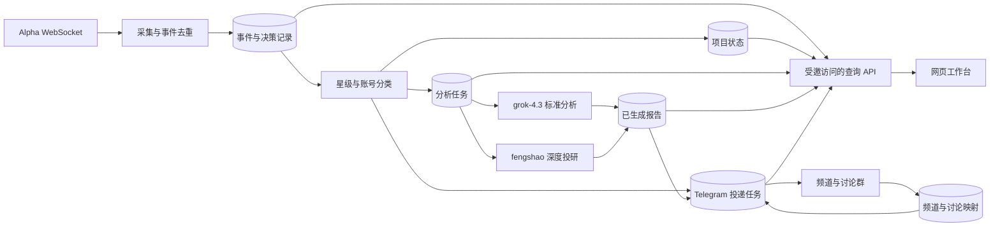

# 前端迁移架构规划

更新时间：2026-09-13。状态：架构评审稿；11 项产品与运行决策已确认，技术方案供整体审阅。

本文根据当前包含未提交改动的工作树做架构审查，并补做隔离的文件并发复现。新架构的容量负载测试尚未执行，目标值不代表已测出的容量。现阶段完成规划，不修改业务流程或部署运行服务。

## 1. 已确认的产品边界

| 决策 | 用户选择 | 对架构的影响 |
|---|---|---|
| Q1：首版范围 | 查看与排查：项目、投研报告、处理进度、过滤原因 | 首版业务接口只读，重点是完整的数据与解释能力 |
| Q2：使用者 | 少量受邀用户，共享同一套监控数据 | 需要独立登录和可撤销的访问权限；共享业务数据，无需按用户隔离监控池 |
| Q3：Telegram 的角色 | 保留现有频道推送，网页展示完整数据 | 网页与 Telegram 服务于同一套业务记录，频道消息需要能关联回项目和报告 |
| Q4：数据保留 | 全部已接收事件保留 90 天，项目和投研报告长期保留 | 需要定期清理和独立于原始事件的报告来源摘要 |
| Q5：Telegram 故障 | 继续生成并保存报告，恢复后补发 | 生成与投递必须解耦，网页完成状态不依赖 Telegram |
| Q6：运行环境 | 一台常驻服务器，受邀用户登录网页 | 后台常驻、同域访问、持久化数据库与备份是部署基线 |
| Q7：登录方式 | 一次性邀请码 + 独立账号密码 | 管理员发放可过期、可撤销、只用一次的邀请；独立用户会话 |
| Q8：验收目标 | 10 人同时在线、100 万条事件、短时 20 条事件/秒；列表 p95 ≤ 1 秒，状态显示 ≤ 3 秒 | 需要索引、游标分页、增量通知及可复现的负载场景 |
| Q9：不确定投递 | 优先避免漏推，继续补发，接受偶发重复 | 采用至少一次投递语义，保存每次尝试，不承诺 Telegram 物理消息严格一次 |
| Q10：模型调用限制 | 暂不设每日上限，限制并发与重试并记录用量 | 使用独立任务池和统一重试预算，监控实际调用与积压 |
| Q11：故障恢复 | 最多丢 1 小时数据，2 小时内恢复 | 服务器外备份、备份时效告警及空环境恢复演练 |

现有业务约束作为迁移基线：标准分析使用 `grok-4.3`；首次达到 5 星时，经 fengshao 的 `grok-4.20-multi-agent-0309` 追加一份深度报告；保留项目去重以及频道与讨论线程的关联。Q5 已确认调整执行依赖：报告生成不再以 Telegram 主消息成功或讨论映射就绪为前提。

## 2. 已收敛的决策树

```text
共享的受邀用户只读工作台（已确认）
├── 全部事件 90 天、项目与报告长期保存（已确认）
├── 生成独立于 Telegram，故障恢复后补发（已确认）
│   ├── 远端结果不确定时优先补发，接受偶发重复
│   └── 模型暂不设每日上限，限制并发/重试并记录用量
├── 一台常驻服务器（已确认）
│   ├── 一次性邀请码 + 独立账号密码
│   └── 数据丢失 ≤ 1 小时，恢复 ≤ 2 小时
└── 网页体验与验收
    ├── 10 并发、100 万事件、峰值 20 条/秒
    ├── 列表 p95 ≤ 1 秒，状态显示 ≤ 3 秒
    └── 实现建议：桌面优先、响应式支持手机
```

产品和运行层面的关键分支已经确认。后文的模块、参数初值和实施顺序是据此形成的工程建议；完成整体审阅后才进入实现。

## 3. 当前架构事实与压力点

| 现状 | 网页化后的影响 | 代码依据 |
|---|---|---|
| 一个长期运行的 Node.js/TypeScript 服务编排 Alpha、Telegram 和分析 worker | 后台任务需要服务端运行，网页关闭不能决定任务生命周期 | `src/main.ts`、`src/service.ts` |
| 尚无自建 HTTP API、浏览器实时接口或网页应用 | 需要新增查询层与前端，不能直接把现有运行入口当作网页接口 | `package.json`、`src/main.ts` |
| 未达阈值、分类拦截等主要输出 console 日志，缺少账号与事件关联 | 无法可靠解释历史账号为什么未推送；需要完整决策记录 | `src/service.ts:240`、`src/service.ts:295` |
| 主消息成功发送后才创建分析任务，生成还依赖讨论群映射 | 与已确认的独立网页报告要求冲突，必须拆开生成与投递 | `src/service.ts:668`、`src/analysis-service.ts:148` |
| 标准报告在评论发送成功后才归档 | 应区分“生成完成”和“投递完成”，并避免重试再次生成成功正文 | `src/analysis-service.ts:189`、`src/service.ts:451` |
| 深度任务已保存正文、固定线程和分片进度 | 迁移必须保留这些检查点与一次性任务语义 | `src/analysis-service.ts:308`、`src/deep-analysis-task.ts` |
| 标准和深度有独立处理循环，但各自内部串行等待 | 长深度任务不直接堵住标准 worker；同类任务仍可能排队很久 | `src/service.ts:786`、`src/analysis-task-queue.ts:329` |
| JSON/JSONL 保存时整体读改写；变更串行化主要是进程内锁 | 多个写入进程存在覆盖风险，多浏览器只读主要放大全文件查询成本 | `src/analysis-task-queue.ts:142`、`src/analysis-archive-store.ts:83` |
| 项目状态、讨论映射、首次分析 tracker 混合使用磁盘与内存 | 拆出多个进程时，不能依靠启动时读一次文件同步状态 | `src/project-state-store.ts`、`src/discussion-store.ts:20` |
| 模型调用没有应用层 deadline，任务文件锁没有续租 | 卡住的请求、过期任务接管和网页长期“处理中”需要明确处理 | `src/xai-client.ts:305`、`src/analysis-task-queue.ts:157` |

两个网页统计字段不能直接沿用：

- `project-state.pushCount` 是频道展示序号。首次直接到 5 星会显示第 5 次，不能据此认定实际发送过 5 条消息。
- 项目状态保存会重新序列化所有项目的 `updatedAt`，不能把它当作每个项目的最近事件时间。

网页必须展示实际生效的配置。目前本地阈值为 `3,8,13,18,23`，代码默认是 `5,8,12,15,20`；本地标准模型为 `grok-4.3`，代码兜底仍是 `grok-4.20-fast`。只展示默认值会误导排查。

## 4. 建议的逻辑边界

业务事实先持久化，再由查询与投递模块分别消费。下面按已确认的 Q5 设计：



通过筛选时，在同一数据库事务中保存判定结果与任务意图。频道主消息投递和分析生成各自推进；报告完成后网页即可读取。讨论评论仍需等对应频道消息与讨论映射就绪，确保报告最终落在正确线程。

因此，新的深度触发点是“首个通过既有筛选规则的 5 星事件”，不再等待 Telegram 成功。任务固定引用该事件的主消息投递意图；Telegram 恢复后取得实际消息 ID，再将深度报告发到对应讨论线程。后续 5 星事件不能替换这个引用。

边界建议：

- 采集器只负责接收、标识和保存事件；不会因浏览器数量增加而重复连接 Alpha。
- 规则模块保留现有星级和分类规则，输出结构化结果，并记录使用的配置版本。
- 分析任务持久化输入、阶段、执行尝试和生成结果。网页刷新不重新调用模型。
- 投递模块维护频道消息、讨论映射、分片和重试；报告正文与 Telegram 消息是不同记录。
- API 提供分页查询、详情、健康状态和实时变更；请求处理期间不直接等待长模型任务。
- 网页通过 API 获取数据；钱包私钥、模型 Key 和 Bot Token 由服务端管理。

同一账号的判定按接收顺序推进，避免较晚事件抢先修改星级和“首次 5 星”记录。不同账号可以并行；网络调用期间不持有长数据库事务。深度分析仍使用执行当时可用的标准报告作为上下文，不强制等待标准报告完成。

## 5. 支撑排查的数据模型

| 数据实体 | 必须能回答的问题 | 关键内容 |
|---|---|---|
| 项目 | 这个账号是什么、当前星级与已有报告如何？ | 内部项目 ID、归一化账号、链接、首次/最近真实事件时间、当前星级 |
| 接收记录与业务事件 | 服务到底有没有收到这条事件，是否重复？ | 每次接收的 ID、原始输入、接收顺序；独立的业务去重键及首条事件引用 |
| 判定记录 | 为什么放行、拦截或跳过？ | 事件 ID、规则版本、当时阈值/星级、分类类型/置信度/理由、明确原因码 |
| 分析任务 | 正在排队、执行、等依赖还是失败？ | 项目与触发事件、标准/深度类型、阶段、尝试次数、开始/心跳/截止时间、错误分类 |
| 报告 | 模型实际生成了什么？ | 类型、正文、生成时间、模型/提示版本、可获得的用量、关联任务 |
| 投递记录 | 是否已发到频道和正确讨论线程？ | 投递目的、关联报告、频道消息、讨论根消息、分片、尝试和结果 |
| 配置版本 | 当时实际采用哪套规则？ | 生效的非敏感配置快照、生效时间；凭证只保留服务端引用 |
| 登录与邀请 | 哪些人可以查看共享数据？ | 用户身份、邀请状态、会话、撤销状态 |

项目和任务使用自己的业务 ID；Telegram 消息 ID 作为外部投递引用，不继续承担全部业务主键的职责。所有收到的目标账号都可建立跟踪记录，项目列表是业务视图；被过滤的账号仍可在排查页检索。

去重应落到持久化约束：事件去重键、项目首次标准任务、项目首次深度任务、投递目的与分片编号。自动首次任务与后续重试属于同一业务意图；失败或进入死信不能伪装成成功完成。

建议的数据库约束与索引：

- 归一化账号唯一；输入链接、展示名和账号标识分开保存。
- 每次接收都保存记录，包括重复与解析失败；业务去重表的来源键唯一，重复接收记录关联首条业务事件并标记原因，不能简单 `ON CONFLICT DO NOTHING` 后丢掉排查依据。
- 只有一个激活的 Alpha 采集器，按接收顺序持久化；单账号判定领取最早尚未处理的事件。按账号、接收顺序和事件 ID 建组合索引，支持有序处理与时间线分页。
- 自动分析任务以项目与报告类型保证唯一，重试使用原任务 ID；深度任务固定首次 5 星的触发事件与主消息投递意图。
- 投递以业务目的、目标频道/线程和分片号保证唯一意图。外部发送可能重复与数据库重复任务是两个不同问题。
- 任务领取使用数据库行锁与到期租约，记录持有者和执行代次；续租和结果提交都检查当前代次。网络请求不占用长数据库事务。

保留策略：原始事件及完整判定时间线保留 90 天，按小批量后台清理，不能级联删除项目或报告。报告长期保存必要来源摘要，例如账号、触发时间、共同关注数、星级和配置/模型版本；过期原始事件在网页显示“原始记录已过保留期”。任务所需的最小执行快照与投递内容独立保存，不能因原始事件清理而丢失未完成工作。长期记录不复制整份原始事件来绕过 90 天保留策略。

“全部事件”指全部业务推送；连接心跳进入独立运行指标。数据库不可用时不能把未提交的事件当作已安全保存，必须暴露采集异常和可能的观察空窗。Alpha 没有已验证的历史回放接口，因此只对实际接收并落库的数据提供可追溯性，不能承诺证明上游曾发生但未送达的事件。

## 6. 页面与状态表达

首版建议四个主要入口，具体布局留到架构与使用偏好明确后设计：

1. 项目列表：按账号搜索、星级和状态筛选，查看最近事件、报告状态、真实发送次数。
2. 项目详情：事件时间线、标准报告、深度报告、相关频道和讨论消息链接。
3. 筛选排查：显示命中门槛、分类结论、去重结果、配置版本和原始输入。
4. 运行状态：采集连接、最近事件、队列等待、正在执行的任务、依赖异常和投递积压。

状态含义必须明确：

| 页面状态 | 需要的证据 |
|---|---|
| 未观察到事件 | 当前保留范围内没有匹配入站记录；不能宣称账号被过滤 |
| 未达推送门槛 | 原始共同关注数、当时阈值和判定时间 |
| 被分类拦截 | 当次分类输入、类型、理由和模型版本 |
| 分类异常后放行 | 记录异常与保守放行策略，不能显示为模型确认了项目身份 |
| 重复事件/未升星 | 对应去重记录或前后星级 |
| 分析排队/执行中 | 持久化任务阶段与心跳；不编造完成百分比 |
| 等待依赖 | 明确是缺讨论映射、限流等待还是其他条件 |
| 报告已生成、投递待完成 | 已保存正文，以及独立的投递任务 |
| 投递失败/状态待确认 | 具体尝试结果；区分明确失败与远端结果不确定 |

当前 multi-agent 模型不提供本地多个研究代理的进度。网页可展示请求与任务阶段，不能凭模型名称生成虚构的代理工作流。

## 7. 查询 API 与实时更新候选

首版业务 API 建议保持只读：

| 接口 | 用途 |
|---|---|
| `GET /api/projects` | 账号搜索、星级/状态筛选、游标分页 |
| `GET /api/projects/:id` | 项目汇总与关联对象 |
| `GET /api/projects/:id/events` | 收到、筛选、分析与投递时间线 |
| `GET /api/events/:id` | 原始输入和完整判定依据 |
| `GET /api/reports/:id` | 标准或深度正文及生成信息 |
| `GET /api/jobs` | 排队、等待、执行和失败任务 |
| `GET /api/health` | 采集器、任务处理和依赖的业务健康 |
| `GET /api/config/effective` | 当前生效的非敏感设置 |
| `GET /api/changes` | SSE 状态变更；实时性目标确定后再确认实现 |

登录采用一次性邀请码与独立账号密码。业务数据共享；首版不提供改变业务规则、人工放行、触发模型或重发 Telegram 的网页接口。

访问管理设计：

- 两种角色：管理员管理邀请和成员，成员只读共享业务数据。首个管理员通过服务器初始化命令创建。
- 邀请使用高熵随机值，数据库仅存摘要，建议 72 小时到期，一次性兑换；管理员可提前撤销。
- 密码采用成熟库的 Argon2id 哈希；不自行设计加密算法。登录和兑换邀请设速率限制。
- 会话保存在服务端，通过 HttpOnly、Secure、SameSite Cookie 使用；同域部署。会员被停用时，API 权限和已建立的 SSE 连接都要失效。
- 密码重置由管理员生成一次性重置凭据，避免首版依赖邮件服务。
- 访问管理写操作需要权限与请求来源校验，并留操作记录；它们与只读业务 API 分开。

实时更新以数据库记录为依据。SSE 支持断线游标、补拉与游标过期后的快照刷新；多个标签页不能触发重复业务执行。数据查询有索引、页大小上限和稳定排序，不能每个浏览器刷新都完整扫描所有 JSONL。

业务事务同时写入变更 outbox，由单个持有数据库锁的发布器为已提交变更分配对外游标；写入 feed 记录与标记 outbox 已发布必须在同一事务完成。不能直接把并发业务事务预分配的自增 ID 当作严格提交顺序，否则可能漏掉晚提交、ID 更小的变更。数据库通知只负责唤醒，补拉依据持久化变更记录；页面按实体版本去重，频繁更新合并刷新。

模型报告和上游文字作为不可信内容渲染：Markdown 不执行原始 HTML，链接限制安全协议。前端资源和 API 返回都不包含凭证。

生效配置接口只按白名单返回阈值、模型、工具、时限和功能开关等字段，不能直接序列化现有 `ServiceConfig` 对象。

## 8. 技术选择的候选方案

根据已确认的共享只读工作台和常驻服务器，技术基线建议如下：

- 前端：React + TypeScript + Vite；主要是登录后的数据应用，当前没有已确认的 SEO/SSR 需求。
- API：Node.js/TypeScript + Fastify，使用共享的请求/响应 schema 做校验，提供 REST 查询与 SSE。
- 后台：复用规则与模型适配器；采集、任务生成、投递保留清晰模块边界，独立于网页请求生命周期。
- 数据库：PostgreSQL，统一事务、唯一约束、查询索引和任务租约；API 与 worker 通过数据库共享状态，不通过各自启动时加载的内存副本同步。
- 通知：数据库变更游标 + SSE。数据库通知可作为唤醒机制，可靠补拉仍以持久化游标为准；首版无需额外 Redis、消息集群或多租户平台。
- 部署：同一服务器提供同域网页/API、独立后台进程与 PostgreSQL；由进程管理器或容器持续运行，前置 HTTPS 入口。

这些是供最终审阅的技术基线。运行时拆成 API 和 worker 两类进程即可；采集、分类、标准分析、深度分析、投递是 worker 内具有独立并发限制的模块，首版不拆成大量微服务。

前端通过查询结果缓存和增量状态更新减少重复请求；模型工作只由后台任务驱动。浏览器断开、重复打开标签页或用户重新登录，都不重新创建分析或投递任务。

标准与深度模型调用将返回统一结果信封，保存可获得的响应 ID、实际模型、正文和供应商报告的用量。未提供的用量显示为未知；供应商汇总 token 不能直接被当作本项目已确认的账单金额。

### 8.1 任务与重试的工程初值

以下为可配置的初始值，用故障测试校验后再调整，不是外部模型的速度承诺：

| 项目 | 初值 |
|---|---|
| 分类任务并发 | 2 |
| 标准分析任务并发 | 2 |
| 深度分析任务并发 | 1 |
| 分类 / 标准 / 深度请求时限 | 60 / 180 / 600 秒 |
| 模型失败重试预算 | 同一任务最多 5 次物理请求，统一在一层调度，避免内外重试次数相乘 |
| 任务租约 | 30 秒，执行时每 10 秒续租；写结果时校验执行代次 |
| Telegram 投递 | 按目标聊天限速，遵守 `retry_after`；单条可恢复故障最多 20 次自动尝试，之后告警并保留待处理记录 |

等待讨论映射不算模型执行失败，也不消耗模型重试预算。鉴权、配置等永久错误暂停失效供应商的请求并告警：标准/深度生成任务等待修复；分类不可用时仍按现有保守策略放行，记录“分类异常后放行”，不能把整个事件筛选队列暂停。网络故障、429 和可恢复错误采用带抖动的退避，达到分类请求失败条件后同样保守放行。

模型正文成功保存后，Telegram 重试只读取已保存正文。请求超时或进程中断、上游结果没有成功保存时，可能再次发生物理模型请求；任务唯一约束不能提供外部模型的严格一次计费保证。

Telegram 无成功回执时，按照 Q9 继续补发。记录不确定的前次尝试，页面提示可能重复；“投递次数”统计使用已确认回执，不冒充远端全部真实消息数量。

Telegram 整体不可用或讨论映射尚未到达时，使用依赖等待状态和限频健康探测，不让每条积压消息不断消耗尝试次数。依赖恢复后自动唤醒等待任务，按账号顺序与聊天限速补发。单条永久错误或预算耗尽时，提供服务器端运维重放路径：修复原因后恢复同一投递任务，保留原意图、正文、分片检查点和历史，并记录操作者；首版不为此增加网页业务写接口。

### 8.2 建议的代码组织

沿用现有仓库与 TypeScript 逻辑，逐步分离职责，保留已有规则的回归测试：

```text
web/                  React 页面、查询缓存、报告展示与 SSE 客户端
shared/               纯数据契约与校验，不引用服务端配置或凭证
src/api/              登录、邀请、只读路由、SSE、健康接口
src/worker/           常驻入口与任务调度
src/domain/           星级、分类决策、项目一次性分析等规则
src/storage/          PostgreSQL repositories、事务、租约与 outbox
src/providers/        Alpha、Grok、Telegram 适配器
migrations/           数据库迁移
tests/                规则、存储、流程、API 与恢复测试
```

迁移时分批移动或封装现有文件，不把目录重组当作前置的大规模重写。前端业务边界不依赖 Telegram Bot 类型。

## 9. 架构压力测试清单

| 场景 | 现有薄弱点 | 新架构必须验证的结果 |
|---|---|---|
| 多浏览器连续筛选翻页 | 全文件读取、排序和临时状态 | 查询分页稳定、刷新不生成任务、不放大模型调用 |
| 多写入者同时接收事件和保存结果 | 进程内锁无法保护跨进程整体读改写 | 不丢事件、不覆盖新结果，业务约束由数据库保证 |
| 模型请求挂起、超时或 worker 被终止 | 无应用层 deadline，文件锁无续租 | 任务阶段可解释、可回收，过期执行者不能覆盖新执行者结果 |
| Telegram 断网或讨论映射缺失 | 分析与投递耦合 | 网页报告继续生成并显示，投递单独等待恢复；不显示错误执行阶段 |
| 远端发送成功后、本地确认前崩溃 | 外部副作用与本地记录不原子 | 暴露结果不确定状态并继续补发，接受偶发重复；不能宣称严格只发送一次 |
| 首次 5 星事件重复/并发到达 | 内存状态和多个任务引用 | 每项目一次自动深度任务，固定原触发事件与线程，重试复用正文 |
| 服务重启、API 切换实例、浏览器重连 | 映射和 tracker 仅在启动时恢复 | 状态一致，不重复生成首次报告；页面恢复准确阶段 |
| 数据损坏、数据库不可用或磁盘满 | 部分错误被当成空状态 | 页面显示数据服务异常，不能显示“没有项目”或“没有事件” |
| 401、429、5xx 与暂时依赖等待 | 等待和失败混用重试计数 | 永久错误、限流、依赖等待分开处理，重试有上限和记录 |
| 未登录、邀请被撤销、恶意模型正文 | 当前没有 Web 权限边界 | 业务接口与实时连接均校验权限，撤销及时生效，正文不能执行脚本 |

实际压测先使用可控的 Alpha、模型和 Telegram 适配器，验证吞吐、等待和故障行为；真实外部请求只用于有范围限制的连通验证。不能通过对真实频道连续发送或大量调用付费模型来测网页容量。

Q8 已确认的验收目标：10 人同时在线、100 万条留存事件、短时每秒 20 条入站事件，列表查询 p95 ≤ 1 秒，数据库状态变化到页面可见 ≤ 3 秒。这些目标待新架构实现后验证，不是现有实测能力；入站高峰时模型任务可以排队，3 秒指标不包含分类或投研生成耗时。此前一次深度请求约 42 秒成功，只能证明该次联通与输出。

详细执行方法、故障注入和当前架构复现证据见 [压力测试与验收方案](frontend-migration-validation.md)。

## 10. 分阶段迁移建议

1. 定义事件、原因码、任务和投递状态；把现有规则测试作为迁移回归基线。
2. 建立事务存储与完整事件审计，导入现有项目、报告、线程映射和未完成任务。
3. 解耦生成/投递依赖，保存标准与深度正文，确保重启可恢复且不重复调用已成功保存正文的报告。
4. 新增受邀访问的只读 API、查询索引、实时状态与健康视图。
5. 实现项目、详情、筛选排查和运行状态页面。
6. 在隔离环境执行压力与故障测试，再验证真实外部链路和切换流程。

历史导入不能伪造过去未保存的事件和分类原因；相关字段标记为历史数据缺失。保留已有 Telegram 消息引用，导入不触发再次推送或再次投研。切换期间明确唯一业务执行者，避免旧、新 worker 同时推送。

备份、恢复和回退必须覆盖数据库写入后的新增数据，不能假设切回旧 JSON 文件就能无损回滚。

### 10.1 部署和恢复

- 一台常驻服务器，同域 HTTPS 网页/API，PostgreSQL 使用持久化卷，worker 由进程管理器自动重启；API、数据库与后台分别检查健康。
- 起始资源建议 2 vCPU、4 GB 内存与 SSD，磁盘容量按合成数据的实际占用和报告增长预留；这不是容量承诺，必须通过验收后再上线。
- 已确认恢复目标：最多丢 1 小时数据、2 小时内恢复。以服务器外已经完成且能验证恢复的备份为准；RPO 按它实际覆盖的数据时间点计算，不能用上传完成时间代替，也不能仅检查本机备份命令成功。
- 初始备份周期建议 30 分钟，为生成、加密、上传和短暂失败留出 1 小时目标的余量；超过 1 小时没有新的有效异地副本就告警。
- 备份加密，密钥和恢复所需凭证有独立恢复方式；备份同机存放不构成服务器损坏后的恢复方案。
- 在空环境恢复数据库、配置与程序，核验项目、报告、任务、线程引用和用户权限，再恢复 worker。恢复后使旧登录会话和未使用邀请失效。
- 备份恢复不是上游历史回放。最多 1 小时的数据丢失是已接受的边界；不能承诺从 Alpha 补回未保存的原始事件。

### 10.2 实施里程碑与出口条件

| 阶段 | 可交付结果 | 完成条件 |
|---|---|---|
| M1：存储与审计 | 数据库 schema、事件落库、原因码、配置版本、只读历史导入 | 所有模拟分支可追溯；旧报告与线程引用导入一致；导入不产生外部请求 |
| M2：任务与投递 | 单账号有序判定、生成/投递解耦、租约、检查点、重试和 outbox | 首次标准/深度任务唯一；Telegram 故障不妨碍网页报告；重启可恢复 |
| M3：访问与查询 | 邀请登录、成员管理、分页 API、SSE 和健康接口 | 未授权请求被拒绝；撤销会话生效；游标恢复无漏更新 |
| M4：前端 | 项目列表、详情、筛选排查、运行状态，响应式页面 | 能解释原先 boopfamily/getsweatai 这类“为什么没推”的已记录事件；不把无记录当拦截 |
| M5：验收与迁移 | 压测报告、故障演练、备份恢复记录、切换与回退步骤 | 性能与恢复指标通过；确认唯一业务执行者后切换 |

上线先验证新系统的影子记录与旧系统判定一致，影子阶段禁止重复投递或重复付费生成。切换时暂停旧 worker，迁移最后增量与未完成任务，再让新 worker 成为唯一执行者。允许短暂切换窗口，窗口内可能丢失的上游事件必须在实际切换方案中说明；当前没有可用的 Alpha 历史接口，不能把回放当作补救保证。

## 11. 完成规划的条件

- 11 项产品与运行决策已明确。
- 每个首版页面需要的数据都有可生成、可保存、可查询的来源。
- API、存储、任务与 Telegram 的职责和业务约束没有相互矛盾。
- 压测的输入规模、验收指标和实际执行范围明确。
- 对这份完整架构评审稿确认理解一致后，再转入实现。业务模型、筛选规则和 Telegram 行为的变更不得借迁移默默扩大。
