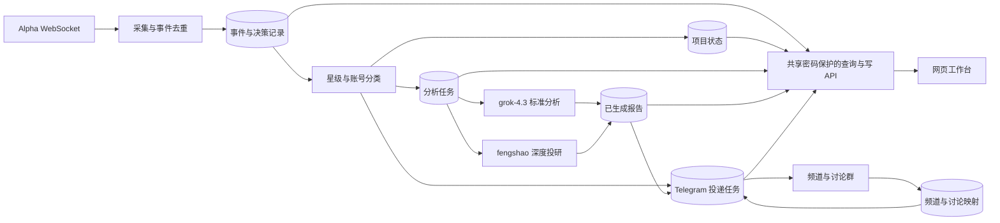

# 前端迁移架构规划

更新时间：2026-09-14。状态：Q1-Q11 产品决策与第 12 节工程决策 Q12-Q126 已确认（含 Q44b/Q44c/Q44d 作废、Q122 修订）。第 13 轮开放问题见文末；实施顺序、出口条件与待确认项见 [实施计划](frontend-migration-implementation.md)；列表层参照见 [参照站拆解](reference-alpha-portal.md)。本稿为规划文档，不改变现有业务流程或部署运行服务。

本文根据当前包含未提交改动的工作树做架构审查，并补做隔离的文件并发复现。新架构的容量负载测试尚未执行，目标值不代表已测出的容量。现阶段完成规划，不修改业务流程或部署运行服务。

## 1. 已确认的产品边界

| 决策 | 用户选择 | 对架构的影响 |
|---|---|---|
| Q1：首版范围 | 查看与排查：项目、投研报告、处理进度、过滤原因；**2026-09-14 修订**：增加网页手动加入项目并排队一次标准分析 | 首版不再是纯只读：新增写操作、管理页面（无角色门禁）、审计记录与模型成本来源（第 12 节 Q44b-Q44e、Q71） |
| Q2：使用者 | 少量受邀用户，共享同一套监控数据；**2026-09-14 修订**：访客用只读密码查看，写操作仅项目所有者（管理员密码） | 访问是两个密码一个门：只读密码限制网页访问，管理员密码才能写；访客无独立账号、不可按人撤销（第 12 节 Q78、Q79、Q71 修订） |
| Q3：Telegram 的角色 | 保留现有频道推送，网页展示完整数据 | 网页与 Telegram 服务于同一套业务记录，频道消息需要能关联回项目和报告 |
| Q4：数据保留 | 全部已接收事件保留 90 天，项目和投研报告长期保留 | 需要定期清理和独立于原始事件的报告来源摘要 |
| Q5：Telegram 故障 | 继续生成并保存报告，恢复后补发 | 生成与投递必须解耦，网页完成状态不依赖 Telegram |
| Q6：运行环境 | 一台常驻服务器，持共享访问密码者登录网页 | 后台常驻、同域访问、持久化数据库与备份是部署基线 |
| Q7：登录方式 | **2026-09-14 修订**：只读密码（访客）+ 管理员密码（写操作）+ 环境变量恢复密码，服务端会话 | 邀请码、独立账号、成员名册取消；忘记密码走恢复密码重置（第 12 节 Q71、Q72、Q78） |
| Q8：验收目标 | 10 人同时在线、100 万条事件、短时 20 条事件/秒；列表 p95 ≤ 1 秒，状态显示 ≤ 3 秒 | 需要索引、游标分页、增量通知及可复现的负载场景 |
| Q9：不确定投递 | 优先避免漏推，继续补发，接受偶发重复 | 采用至少一次投递语义，保存每次尝试，不承诺 Telegram 物理消息严格一次 |
| Q10：模型调用限制 | 暂不设每日上限，限制并发与重试并记录用量 | 使用独立任务池和统一重试预算，监控实际调用与积压 |
| Q11：故障恢复 | 最多丢 1 小时数据，2 小时内恢复 | 服务器外备份、备份时效告警及空环境恢复演练 |

现有业务约束作为迁移基线：标准分析使用 `grok-4.3`；首次达到 5 星时，经 fengshao 的 `grok-4.20-multi-agent-0309` 追加一份深度报告；保留项目去重以及频道与讨论线程的关联。Q5 已确认调整执行依赖：报告生成不再以 Telegram 主消息成功或讨论映射就绪为前提。

## 2. 已收敛的决策树

```text
共享访问密钥的网页工作台：访客只读、所有者可写（已确认，第 12 节 Q78-Q85）
├── 全部事件 90 天、项目与报告长期保存（已确认）
├── 生成独立于 Telegram，故障恢复后补发（已确认）
│   ├── 远端结果不确定时优先补发，接受偶发重复
│   └── 模型暂不设每日上限，限制并发/重试并记录用量
├── 一台常驻服务器（已确认）
│   ├── 共享访问密钥（环境变量）+ 写操作管理员密码（Q78、Q84）
│   └── 数据丢失 ≤ 1 小时，恢复 ≤ 2 小时
└── 网页体验与验收
    ├── 10 并发、100 万事件、峰值 20 条/秒
    ├── 列表 p95 ≤ 1 秒，状态显示 ≤ 3 秒
    └── 实现建议：桌面优先、响应式支持手机
```

产品和运行层面的关键分支已经确认。后文的模块、参数初值和实施顺序是据此形成的工程建议；完成整体审阅后才进入实现。

## 3. 当前架构事实与压力点

| 现状 | 网页化后的影响 | 代码依据 |
|---|---|---|
| 一个长期运行的 Node.js/TypeScript 服务编排 Alpha、Telegram 和分析 worker | 后台任务需要服务端运行，网页关闭不能决定任务生命周期 | `src/main.ts`、`src/service.ts` |
| 尚无自建 HTTP API、浏览器实时接口或网页应用 | 需要新增查询层与前端，不能直接把现有运行入口当作网页接口 | `package.json`、`src/main.ts` |
| 未达阈值、分类拦截等主要输出 console 日志，缺少账号与事件关联 | 无法可靠解释历史账号为什么未推送；需要完整决策记录 | `src/service.ts:240`、`src/service.ts:295` |
| 主消息成功发送后才创建分析任务，生成还依赖讨论群映射 | 与已确认的独立网页报告要求冲突，必须拆开生成与投递 | `src/service.ts:668`、`src/analysis-service.ts:148` |
| 标准报告在评论发送成功后才归档 | 应区分“生成完成”和“投递完成”，并避免重试再次生成成功正文 | `src/analysis-service.ts:189`、`src/service.ts:451` |
| 深度任务已保存正文、固定线程和分片进度 | 迁移必须保留这些检查点与一次性任务语义 | `src/analysis-service.ts:308`、`src/deep-analysis-task.ts` |
| 标准和深度有独立处理循环，但各自内部串行等待 | 长深度任务不直接堵住标准 worker；同类任务仍可能排队很久 | `src/service.ts:786`、`src/analysis-task-queue.ts:329` |
| JSON/JSONL 保存时整体读改写；变更串行化主要是进程内锁 | 多个写入进程存在覆盖风险，多浏览器只读主要放大全文件查询成本 | `src/analysis-task-queue.ts:142`、`src/analysis-archive-store.ts:83` |
| 项目状态、讨论映射、首次分析 tracker 混合使用磁盘与内存 | 拆出多个进程时，不能依靠启动时读一次文件同步状态 | `src/project-state-store.ts`、`src/discussion-store.ts:20` |
| 模型调用没有应用层 deadline，任务文件锁没有续租 | 卡住的请求、过期任务接管和网页长期“处理中”需要明确处理 | `src/xai-client.ts:305`、`src/analysis-task-queue.ts:157` |

两个网页统计字段不能直接沿用：

- `project-state.pushCount` 是频道展示序号。首次直接到 5 星会显示第 5 次，不能据此认定实际发送过 5 条消息。
- 项目状态保存会重新序列化所有项目的 `updatedAt`，不能把它当作每个项目的最近事件时间。

网页必须展示实际生效的配置。目前本地阈值为 `3,8,13,18,23`，代码默认是 `5,8,12,15,20`；本地标准模型为 `grok-4.3`，代码兜底仍是 `grok-4.20-fast`。只展示默认值会误导排查。

## 4. 建议的逻辑边界

业务事实先持久化，再由查询与投递模块分别消费。下面按已确认的 Q5 设计：



通过筛选时，在同一数据库事务中保存判定结果与任务意图。频道主消息投递和分析生成各自推进；报告完成后网页即可读取。讨论评论仍需等对应频道消息与讨论映射就绪，确保报告最终落在正确线程。

因此，新的深度触发点是“首个通过既有筛选规则的 5 星事件”，不再等待 Telegram 成功。任务固定引用该事件的主消息投递意图；Telegram 恢复后取得实际消息 ID，再将深度报告发到对应讨论线程。后续 5 星事件不能替换这个引用。

边界建议：

- 采集器只负责接收、标识和保存事件；不会因浏览器数量增加而重复连接 Alpha。
- 规则模块保留现有星级和分类规则，输出结构化结果，并记录使用的配置版本。
- 分析任务持久化输入、阶段、执行尝试和生成结果。网页刷新不重新调用模型。
- 投递模块维护频道消息、讨论映射、分片和重试；报告正文与 Telegram 消息是不同记录。
- API 提供分页查询、详情、健康状态、实时变更，以及受二次确认与审计保护的写操作端点；请求处理期间不直接等待长模型任务。
- 网页通过 API 获取数据；钱包私钥、模型 Key 和 Bot Token 由服务端管理。

同一账号的判定按接收顺序推进，避免较晚事件抢先修改星级和“首次 5 星”记录。不同账号可以并行；网络调用期间不持有长数据库事务。深度分析仍使用执行当时可用的标准报告作为上下文，不强制等待标准报告完成。

## 5. 支撑排查的数据模型

| 数据实体 | 必须能回答的问题 | 关键内容 |
|---|---|---|
| 项目 | 这个账号是什么、当前星级与已有报告如何？ | 内部项目 ID、归一化账号、链接、首次/最近真实事件时间、当前星级 |
| 接收记录与业务事件 | 服务到底有没有收到这条事件，是否重复？ | 每次接收的 ID、原始输入、接收顺序；独立的业务去重键及首条事件引用 |
| 判定记录 | 为什么放行、拦截或跳过？ | 事件 ID、规则版本、当时阈值/星级、分类类型/置信度/理由、明确原因码 |
| 分析任务 | 正在排队、执行、等依赖还是失败？ | 项目与触发事件、标准/深度类型、阶段、尝试次数、开始/心跳/截止时间、错误分类 |
| 报告 | 模型实际生成了什么？ | 类型、正文、生成时间、模型/提示版本、可获得的用量、关联任务 |
| 投递记录 | 是否已发到频道和正确讨论线程？ | 投递目的、关联报告、频道消息、讨论根消息、分片、尝试和结果 |
| 配置版本 | 当时实际采用哪套规则？ | 生效的非敏感配置快照、生效时间；凭证只保留服务端引用 |
| 访问与会话 | 当前是否处于已登录状态？ | 单一共享密码哈希、服务端会话、改密码触发的全局失效（第 12 节 Q71-Q73） |

项目和任务使用自己的业务 ID；Telegram 消息 ID 作为外部投递引用，不继续承担全部业务主键的职责。所有收到的目标账号都可建立跟踪记录，项目列表是业务视图；被过滤的账号仍可在排查页检索。

去重应落到持久化约束：事件去重键、项目首次标准任务、项目首次深度任务、投递目的与分片编号。自动首次任务与后续重试属于同一业务意图；失败或进入死信不能伪装成成功完成。

建议的数据库约束与索引：

- 归一化账号唯一；输入链接、展示名和账号标识分开保存。
- 每次接收都保存记录，包括重复与解析失败；业务去重表的来源键唯一，重复接收记录关联首条业务事件并标记原因，不能简单 `ON CONFLICT DO NOTHING` 后丢掉排查依据。
- 只有一个激活的 Alpha 采集器，按接收顺序持久化；单账号判定领取最早尚未处理的事件。按账号、接收顺序和事件 ID 建组合索引，支持有序处理与时间线分页。
- 自动分析任务以项目与报告类型保证唯一，重试使用原任务 ID；深度任务固定首次 5 星的触发事件与主消息投递意图。
- 投递以业务目的、目标频道/线程和分片号保证唯一意图。外部发送可能重复与数据库重复任务是两个不同问题。
- 任务领取使用数据库行锁与到期租约，记录持有者和执行代次；续租和结果提交都检查当前代次。网络请求不占用长数据库事务。

保留策略：原始事件及完整判定时间线保留 90 天，按小批量后台清理，不能级联删除项目或报告。报告长期保存必要来源摘要，例如账号、触发时间、共同关注数、星级和配置/模型版本；过期原始事件在网页显示“原始记录已过保留期”。任务所需的最小执行快照与投递内容独立保存，不能因原始事件清理而丢失未完成工作。长期记录不复制整份原始事件来绕过 90 天保留策略。

**历史导入的数据可得性边界**（2026-09-14 核实现有代码与 data/）：

- 可导入的现存事实只有：3 个项目的 star/pushCount/firstChannelMessage、3 份标准报告正文、8 条讨论映射，以及每条归档的 title/content/link/count/star/mainPushedAt 与消息引用。
- 从未落盘、因此首版只能显示“历史数据缺失”的有：真实事件时间（`push_at`）、真实推送次数、被拦截项目的原始输入与分类理由、去重结论、当时阈值与配置版本、逐事件投递状态、采集与队列历史指标。
- 分类拦截今天不创建任何项目记录（`src/service.ts:309` 仅 console），分类置信度在 `src/service.ts:849-853` 被丢弃；因此**已排除项目列表只能从实现后开始记录**，历史拦截项目无法还原。
- 结论：新增记录（接收记录、判定记录、投递记录、任务阶段与心跳、运行指标）是页面目标的必要条件，不能靠导入旧数据替代。

“全部事件”指全部业务推送；连接心跳进入独立运行指标。数据库不可用时不能把未提交的事件当作已安全保存，必须暴露采集异常和可能的观察空窗。Alpha 没有已验证的历史回放接口，因此只对实际接收并落库的数据提供可追溯性，不能承诺证明上游曾发生但未送达的事件。

## 6. 页面与状态表达

首版页面（2026-09-14 定案，列表层参照 alpha.fajiazhifu.cc，见 [参照站拆解](reference-alpha-portal.md)）：

1. **第一栏：项目池**（参照站“热度榜单”行的形态）：按账号搜索，按星级、加入监控时间、是否有 CA 分类筛选；CA 从 Grok 分析结果中提取，无 CA 时保留“无 CA”筛选位（Q110）。行内以多个独立徽章表达来源、监控状态、最近判定、任务阶段、投递状态（Q97）；推送计数主列显示频道展示序号、悬停显示真实发送次数（Q96）。
2. **第二栏：最近动态**（参照站“最新发现”卡片流的形态）：按接收/判定时间倒序，展示原始输入摘要、判定结论与原因码、报告状态；卡内摘要 + 详情页读全文（Q93）。
3. **第三栏：推特喊单**（Q105、Q108-Q115）：检索 X 上提及监控池账号的推文并实时展示。数据来自第三方聚合服务，仅覆盖核心池（星级 ≥3 或手动加入），每 5–10 分钟轮询；匹配采用关键词检索 + 本地二次校验（Q111）；抓到的推文入库去重后由页面读取（Q112）；新推文以页面内消息条 + 高亮提示呈现，不做声音与系统通知（Q114）；没有检测到提及时不显示该栏内容（Q113）。
4. **已排除项目（可收起栏）**（Q100、Q104、Q132-Q136）：收录两类来源——规则判定拦截的项目，以及人工从池内移入排除池的项目（按进入原因区分）。规则拦截的行显示 AI 排除理由、共同关注数、分类 type 与置信度、拦截时间、当时生效的阈值与模型；人工排除的行显示排除时间、排除时星级与事件数。每行带“恢复”按钮（Q103：恢复监控 + 排队一次标准分析，不绕过阈值）。
5. **项目详情**：全量时间线（接收/判定/任务/投递混排，同类事件折叠，Q99）、标准报告、深度报告、频道与讨论消息链接、触发事件引用与任务阶段。
6. **判定排查**：以“按账号查”为主入口展开完整判定链（Q100），显示原始输入、当时阈值与配置版本、分类结论、去重结论、原因码。
7. **运行状态**：业务健康优先的指标集合（Q101），以及配置变更时间线（Q102）。
8. **管理入口**：管理员密码验证后才可用（Q84）；承载“把池内项目移入排除池”、从排除列表恢复、投递重放、配置变更记录查看（手动加入项目已取消，Q122）。

状态含义必须明确：

| 页面状态 | 需要的证据 |
|---|---|
| 未观察到事件 | 当前保留范围内没有匹配入站记录；不能宣称账号被过滤 |
| 未达推送门槛 | 原始共同关注数、当时阈值和判定时间 |
| 被分类拦截 | 当次分类输入、类型、理由和模型版本 |
| 分类异常后放行 | 记录异常与保守放行策略，不能显示为模型确认了项目身份 |
| 重复事件/未升星 | 对应去重记录或前后星级 |
| 分析排队/执行中 | 持久化任务阶段与心跳；不编造完成百分比 |
| 等待依赖 | 明确是缺讨论映射、限流等待还是其他条件 |
| 报告已生成、投递待完成 | 已保存正文，以及独立的投递任务 |
| 投递失败/状态待确认 | 具体尝试结果；区分明确失败与远端结果不确定 |

当前 multi-agent 模型不提供本地多个研究代理的进度。网页可展示请求与任务阶段，不能凭模型名称生成虚构的代理工作流。

## 7. 查询 API 与实时更新候选

首版业务 API 以查询为主，另含受二次确认与审计保护的写入/管理端点：

| 接口 | 用途 |
|---|---|
| `GET /api/projects` | 账号搜索、星级/状态筛选、游标分页 |
| `GET /api/projects/:id` | 项目汇总与关联对象 |
| `GET /api/projects/:id/events` | 收到、筛选、分析与投递时间线 |
| `GET /api/events/:id` | 原始输入和完整判定依据 |
| `GET /api/reports/:id` | 标准或深度正文及生成信息 |
| `GET /api/jobs` | 排队、等待、执行和失败任务 |
| `GET /api/health` | 采集器、任务处理和依赖的业务健康 |
| `GET /api/config/effective` | 当前生效的非敏感设置 |
| `GET /api/changes` | 状态变更流（二期：SSE + outbox 游标）；首版以 2 秒轮询实现状态刷新，见第 12 节 Q14 |

访问模型最终形态（第 12 节 Q78-Q85）：一个**共享访问密钥**用于打开网页（所有视图可读），一个**管理员密码**用于写操作。密钥首次输入正确后签发长期、自动续期的 HttpOnly Cookie，不反复输入；密钥不轮换（用户明确“不换密码”），因此**没有按人撤销手段**——唯一隔离访客的办法是在服务端清除会话并让所有人重新输入密钥。首版网页承担读写与管理操作，不再提供 CLI 通道（Q44c、Q48）；投递重放、手动加入项目、改密码等写操作都带二次确认与审计（Q54、Q59）。网页不提供改变业务规则、编造当前判定或绕过阈值推送的接口，但允许人工把账号加入监控池并触发一次标准分析（Q44b）。

访问管理设计：

- 共享访问密钥由环境变量明文配置（Q83），服务端只在验证时比对；管理员密码同样由环境变量配置，并附一份**恢复密码**用于忘记时重置（Q72）。
- 写操作只在管理员会话下可用：未通过管理员密码的会话访问写路由一律 403，不因为知道访问密钥而获得写权限（Q84）。
- 访问密钥不轮换、不设有效期（Q79、Q82）；管理员密码修改后，全部管理员会话立即失效、仅保留操作者当前会话（Q73）。
- 共享访问密钥没有轮换功能；如需强制所有人重新验证，只能清除服务端会话记录（Q79）。这被接受为“不换密码”的直接代价。
- 会话保存在服务端，通过 HttpOnly、Secure、SameSite Cookie 使用；同域部署，经自签证书 HTTPS（Q22）。
- 登录、改密码与恢复流程设速率限制；写操作接口校验请求来源，敏感操作二次确认（Q54）。
- 审计记录写操作与分析导出（何时、动作、目标、改动前后摘要）；**不记录任何操作者身份**，包括管理员（Q75、Q85）。审计能还原“发生了什么”，不能回答“是谁做的”。
- 没有“成员停用”“邀请撤销”“密码重置凭据”这些动作；人员离开的处理方式是清除服务端会话（必要时同时更换访问密钥的环境变量并重启）。
- 首版不提供运维页（备份/恢复/健康），二期再评估（Q61）。

实时更新以数据库记录为依据。首版状态刷新以轮询 + 实体版本号去重实现（第 12 节 Q14）：列表页与运行状态页 2 秒、项目详情页 5 秒，标签页不可见时暂停轮询（Q25）；以下 SSE 与 outbox 设计作为二期增强保留。SSE 支持断线游标、补拉与游标过期后的快照刷新；多个标签页不能触发重复业务执行。数据查询有索引、页大小上限和稳定排序，不能每个浏览器刷新都完整扫描所有 JSONL。

业务事务同时写入变更 outbox，由单个持有数据库锁的发布器为已提交变更分配对外游标；写入 feed 记录与标记 outbox 已发布必须在同一事务完成。不能直接把并发业务事务预分配的自增 ID 当作严格提交顺序，否则可能漏掉晚提交、ID 更小的变更。数据库通知只负责唤醒，补拉依据持久化变更记录；页面按实体版本去重，频繁更新合并刷新。

模型报告和上游文字作为不可信内容渲染：Markdown 不执行原始 HTML，链接限制安全协议。前端资源和 API 返回都不包含凭证。

生效配置接口只按白名单返回阈值、模型、工具、时限和功能开关等字段，不能直接序列化现有 `ServiceConfig` 对象。

## 8. 技术选择的候选方案

根据已确认的共享密码网页读写工作台和常驻服务器，技术基线建议如下：

- 前端：React + TypeScript + Vite；主要是登录后的数据应用，当前没有已确认的 SEO/SSR 需求。
- API：Node.js/TypeScript + Fastify，使用共享的请求/响应 schema 做校验，提供 REST 查询与 SSE。
- 后台：复用规则与模型适配器；采集、任务生成、投递保留清晰模块边界，独立于网页请求生命周期。
- 数据库：PostgreSQL，统一事务、唯一约束、查询索引和任务租约；API 与 worker 通过数据库共享状态，不通过各自启动时加载的内存副本同步。
- 通知：首版以 2 秒轮询实现页面刷新，数据库变更游标 + SSE 为二期增强（第 12 节 Q14）。数据库通知可作为唤醒机制，可靠补拉仍以持久化游标为准；首版无需额外 Redis、消息集群或多租户平台。
- 部署：沿用现有 8 vCPU、24GB 服务器（第 12 节 Q23），Docker Compose 运行 postgres、api、worker 三个服务（Q24），PM2 退役；网页/API 经自签证书 HTTPS 提供服务器 IP + 端口访问（Q13、Q22），首次访问者信任自签证书。

这些是供最终审阅的技术基线。运行时拆成 API 和 worker 两类进程即可；采集、分类、标准分析、深度分析、投递是 worker 内具有独立并发限制的模块，首版不拆成大量微服务。

前端通过查询结果缓存和增量状态更新减少重复请求；模型工作只由后台任务驱动。浏览器断开、重复打开标签页或用户重新登录，都不重新创建分析或投递任务。

标准与深度模型调用将返回统一结果信封，保存可获得的响应 ID、实际模型、正文和供应商报告的用量。未提供的用量显示为未知；供应商汇总 token 不能直接被当作本项目已确认的账单金额。

### 8.1 任务与重试的工程初值

以下为可配置的初始值，用故障测试校验后再调整，不是外部模型的速度承诺：

| 项目 | 初值 |
|---|---|
| 分类任务并发 | 2 |
| 标准分析任务并发 | 2 |
| 深度分析任务并发 | 1 |
| 分类 / 标准 / 深度请求时限 | 60 / 180 / 600 秒 |
| 模型失败重试预算 | 同一任务最多 5 次物理请求，统一在一层调度，避免内外重试次数相乘 |
| 任务租约 | 30 秒，执行时每 10 秒续租；写结果时校验执行代次 |
| Telegram 投递 | 按目标聊天限速，遵守 `retry_after`；单条可恢复故障最多 20 次自动尝试，之后告警并保留待处理记录 |

等待讨论映射不算模型执行失败，也不消耗模型重试预算。鉴权、配置等永久错误暂停失效供应商的请求并告警：标准/深度生成任务等待修复；分类不可用时仍按现有保守策略放行，记录“分类异常后放行”，不能把整个事件筛选队列暂停。网络故障、429 和可恢复错误采用带抖动的退避，达到分类请求失败条件后同样保守放行。

模型正文成功保存后，Telegram 重试只读取已保存正文。请求超时或进程中断、上游结果没有成功保存时，可能再次发生物理模型请求；任务唯一约束不能提供外部模型的严格一次计费保证。

Telegram 无成功回执时，按照 Q9 继续补发。记录不确定的前次尝试，页面提示可能重复；“投递次数”统计使用已确认回执，不冒充远端全部真实消息数量。

Telegram 整体不可用或讨论映射尚未到达时，使用依赖等待状态和限频健康探测，不让每条积压消息不断消耗尝试次数。依赖恢复后自动唤醒等待任务，按账号顺序与聊天限速补发。单条永久错误或预算耗尽时，通过网页投递重放恢复同一投递任务：预览目标与正文、二次确认、必填重放原因、同投递幂等键，保留原意图、正文、分片检查点和历史，并写入审计（第 12 节 Q59）。不再有服务器端 CLI 或 SSH 重放路径。

### 8.2 建议的代码组织

沿用现有仓库与 TypeScript 逻辑，逐步分离职责，保留已有规则的回归测试：

```text
web/                  React 页面、查询缓存、报告展示与 SSE 客户端
shared/               纯数据契约与校验，不引用服务端配置或凭证
src/api/              登录（共享密码）、查询路由、写入与管理路由、SSE、健康接口
src/worker/           常驻入口与任务调度
src/domain/           星级、分类决策、项目一次性分析等规则
src/storage/          PostgreSQL repositories、事务、租约与 outbox
src/providers/        Alpha、Grok、Telegram 适配器
migrations/           数据库迁移
tests/                规则、存储、流程、API 与恢复测试
```

迁移时分批移动或封装现有文件，不把目录重组当作前置的大规模重写。前端业务边界不依赖 Telegram Bot 类型。

## 9. 架构压力测试清单

| 场景 | 现有薄弱点 | 新架构必须验证的结果 |
|---|---|---|
| 多浏览器连续筛选翻页 | 全文件读取、排序和临时状态 | 查询分页稳定、刷新不生成任务、不放大模型调用 |
| 多写入者同时接收事件和保存结果 | 进程内锁无法保护跨进程整体读改写 | 不丢事件、不覆盖新结果，业务约束由数据库保证 |
| 模型请求挂起、超时或 worker 被终止 | 无应用层 deadline，文件锁无续租 | 任务阶段可解释、可回收，过期执行者不能覆盖新执行者结果 |
| Telegram 断网或讨论映射缺失 | 分析与投递耦合 | 网页报告继续生成并显示，投递单独等待恢复；不显示错误执行阶段 |
| 远端发送成功后、本地确认前崩溃 | 外部副作用与本地记录不原子 | 暴露结果不确定状态并继续补发，接受偶发重复；不能宣称严格只发送一次 |
| 首次 5 星事件重复/并发到达 | 内存状态和多个任务引用 | 每项目一次自动深度任务，固定原触发事件与线程，重试复用正文 |
| 服务重启、API 切换实例、浏览器重连 | 映射和 tracker 仅在启动时恢复 | 状态一致，不重复生成首次报告；页面恢复准确阶段 |
| 数据损坏、数据库不可用或磁盘满 | 部分错误被当成空状态 | 页面显示数据服务异常，不能显示“没有项目”或“没有事件” |
| 401、429、5xx 与暂时依赖等待 | 等待和失败混用重试计数 | 永久错误、限流、依赖等待分开处理，重试有上限和记录 |
| 未登录或会话已失效、恶意模型正文 | 当前没有 Web 权限边界 | 业务接口与实时连接都校验登录态；改密码后全部旧会话失效；正文不能执行脚本 |
| 影子期新旧判定对比 | 旧系统判定只写 console 日志、去重集不落盘、分类不可复现 | 逐事件可比：确定性结论全量对齐，分类差异有证据与阈值；旧 worker 重启窗口被标记并重置达标窗口（第 12 节 Q30-Q39） |

实际压测先使用可控的 Alpha、模型和 Telegram 适配器，验证吞吐、等待和故障行为；真实外部请求只用于有范围限制的连通验证。不能通过对真实频道连续发送或大量调用付费模型来测网页容量。

Q8 已确认的验收目标：10 人同时在线、100 万条留存事件、短时每秒 20 条入站事件，列表查询 p95 ≤ 1 秒，数据库状态变化到页面可见 ≤ 3 秒。这些目标待新架构实现后验证，不是现有实测能力；入站高峰时模型任务可以排队，3 秒指标不包含分类或投研生成耗时。此前一次深度请求约 42 秒成功，只能证明该次联通与输出。

详细执行方法、故障注入和当前架构复现证据见 [压力测试与验收方案](frontend-migration-validation.md)。

## 10. 分阶段迁移建议

1. 定义事件、原因码、任务和投递状态；把现有规则测试作为迁移回归基线。
2. 建立事务存储与完整事件审计，导入现有项目、报告、线程映射和未完成任务。
3. 解耦生成/投递依赖，保存标准与深度正文，确保重启可恢复且不重复调用已成功保存正文的报告。
4. 新增共享密码访问的查询与写管理 API、查询索引、实时状态与健康视图。
5. 实现项目、详情、筛选排查和运行状态页面。
6. 在隔离环境执行压力与故障测试，再验证真实外部链路和切换流程。

历史导入不能伪造过去未保存的事件和分类原因；相关字段标记为历史数据缺失。保留已有 Telegram 消息引用，导入不触发再次推送或再次投研。切换期间明确唯一业务执行者，避免旧、新 worker 同时推送。

备份、恢复和回退必须覆盖数据库写入后的新增数据，不能假设切回旧 JSON 文件就能无损回滚。

### 10.1 部署和恢复

- 一台常驻服务器（现有 8 vCPU、24GB 内存，第 12 节 Q23），网页/API 经自签证书 HTTPS 提供服务器 IP 与端口访问（第 12 节 Q13、Q22），PostgreSQL 使用持久化卷，Compose 服务自动重启；API、数据库与后台分别检查健康。
- 告警（备份滞后、任务预算耗尽、采集异常等）经现有 Telegram bot 私聊固定运维接收人发出（第 12 节 Q17），零新增依赖。分三级：紧急（采集异常、数据不可用）、重要（任务预算耗尽、备份滞后）、提示（恢复通知）；同一告警键 30 分钟静默，恢复时发送"已恢复"（Q26）。
- 现有服务器为 8 vCPU、24GB 内存（第 12 节 Q23），远超 2 vCPU/4GB 的起始建议；磁盘容量按合成数据的实际占用和报告增长预留，仍须通过验收后再上线。
- 已确认恢复目标：最多丢 1 小时数据、2 小时内恢复。以服务器外已经完成且能验证恢复的备份为准；RPO 按它实际覆盖的数据时间点计算，不能用上传完成时间代替，也不能仅检查本机备份命令成功。
- 初始备份周期建议 30 分钟，为生成、加密、上传和短暂失败留出 1 小时目标的余量；超过 1 小时没有新的有效异地副本就告警。目的地为 Cloudflare R2，保留最近 48 份（约 24 小时）；age 密钥存密码管理器并打印一份离线（第 12 节 Q29）。
- 备份采用 pg_dump + 压缩 + age 加密后上传（第 12 节 Q27）；密钥和恢复所需凭证有独立恢复方式；备份同机存放不构成服务器损坏后的恢复方案。
- 在空环境恢复数据库、配置与程序，核验项目、报告、任务与线程引用，以及共享访问密码可用，再恢复 worker。恢复后使全部旧会话失效（第 12 节 Q73）。
- 备份恢复不是上游历史回放。最多 1 小时的数据丢失是已接受的边界；不能承诺从 Alpha 补回未保存的原始事件。

### 10.2 实施里程碑与出口条件

| 阶段 | 可交付结果 | 完成条件 |
|---|---|---|
| M1：存储与审计 | 数据库 schema、事件落库、原因码、配置版本、只读历史导入 | 所有模拟分支可追溯；旧报告与线程引用导入一致；导入不产生外部请求 |
| M2：任务与投递 | 单账号有序判定、生成/投递解耦、租约、检查点、重试和 outbox | 首次标准/深度任务唯一；Telegram 故障不妨碍网页报告；重启可恢复 |
| M3：访问与查询 | 共享密码登录、写操作审计、分页 API、SSE 和健康接口 | 未登录请求被拒绝；改密码后旧会话全部失效；游标恢复无漏更新 |
| M4：前端 | 项目列表、详情、筛选排查、运行状态，响应式页面 | 能解释原先 boopfamily/getsweatai 这类“为什么没推”的已记录事件；不把无记录当拦截 |
| M5：验收与迁移 | 压测报告、故障演练、备份恢复记录、切换与回退步骤 | 性能与恢复指标通过；确认唯一业务执行者后切换 |

上线先验证新系统的影子记录与旧系统判定一致：影子至少运行 3 个自然日，且达到最小样本量（判定事件与分类触发量首轮校准），期间星级与去重判定 100% 匹配、分类差异不超过校准阈值；旧 worker 重启即窗口重置（第 12 节 Q16、Q36、Q39）；影子阶段新旧服务同机并行（第 12 节 Q23），为 PostgreSQL 等新组件设置资源上限避免影响旧 worker，新栈以影子模式运行，禁止重复投递或重复付费生成。切换时暂停旧 worker，目标 ≤10 分钟，迁移最后增量与未完成任务，再让新 worker 成为唯一执行者。允许短暂切换窗口，窗口内可能丢失的上游事件必须在实际切换方案中说明；当前没有可用的 Alpha 历史接口，不能把回放当作补救保证。切换后旧 PM2 服务与 JSONL 数据只读保留 30 天作为回退参照，之后归档清理（第 12 节 Q28）。

**⚠️ 影子期不得新开上游连接（2026-09-14 实测）**：同一钱包开第二条 Alpha WebSocket 后，
**业务事件只投递给最近一次登录的那条连接**，而心跳对旧连接仍照常广播。
后果是旧 worker 进程健康、心跳正常、日志无报错，但**业务推送静默停止**。
因此影子期必须走第 12 节 Q32-B 的“旧 worker 旁路写本地 sink、新栈消费 sink”路径；
任何“影子独立再连一次上游”的试探都只能在停机窗口内进行（并接受窗口内漏推）。
实测数据见 [压力测试与验收方案](frontend-migration-validation.md) 第 21 节。

## 11. 完成规划的条件

- Q1-Q11 产品边界与第 12 节 Q12-Q73 工程决策已明确；第 6 轮开放问题已列明。
- 每个首版页面需要的数据都有可生成、可保存、可查询的来源。
- API、存储、任务与 Telegram 的职责和业务约束没有相互矛盾。
- 压测的输入规模、验收指标和实际执行范围明确。
- 对这份完整架构评审稿确认理解一致后，再转入实现。业务模型、筛选规则和 Telegram 行为的变更不得借迁移默默扩大。

## 12. 架构拷问第 1 轮结论（Q12-Q21，2026-09-14 确认）

已知事实基线（2026-09-14 核对）：`data/project-state.json` 含 3 个项目（berauniversity、getstonkoptions、boopfamily），归档分析 3 份，讨论映射 8 条，分析队列为空；现网 PM2 单进程、512M 内存上限。100 万事件与 20 条/秒为前瞻验收目标，不是现状压力。

| 决策 | 用户选择 | 对架构的影响 |
|---|---|---|
| Q12 技术栈 | 按第 8 节候选定案：React + TypeScript + Vite、Fastify、PostgreSQL | 第 8 节由候选转为实现基线 |
| Q13 部署形态 | 无域名；服务器 IP + 端口直接访问；PostgreSQL 与应用用 Docker Compose | 取消域名与前置 HTTPS 依赖；传输安全策略（明文风险）进入第 2 轮确认 |
| Q14 实时机制 | 首版轮询：2 秒间隔 + 实体版本号去重；SSE + outbox 为二期 | 第 7 节 `/api/changes` 与 outbox 设计标注二期；F8/F9 验收改写为轮询语义 |
| Q15 历史导入 | 只导入现存事实（3 项目状态、3 归档报告、8 讨论映射、空队列）与 Telegram 消息引用 | 历史事件时间线标"历史数据缺失"，不伪造、不补录 |
| Q16 影子与切换 | 影子 ≥3 天且星级、分类、去重三类判定 100% 匹配；切换暂停 ≤10 分钟 | 切换窗口与匹配标准定量化，空窗按 Q11 边界记录 |
| Q17 告警通道 | 复用现有 Telegram bot 私聊固定运维接收人 | 零新增依赖；告警分级与静默策略进入第 2 轮 |
| Q18 管理操作 | **2026-09-14 修订**：完全取消 CLI，全部操作走网页（Q44c、Q48）；**三次修订**：写操作需管理员密码，访客只有只读权限 | 首版需管理员写入口、CSRF/来源校验、二次确认与写操作审计；原“全部走 CLI”作废，“仅管理员可写”恢复成立 |
| Q19 会话时长 | 7 天滑动过期；**2026-09-14 修订**：改密码时全部会话立即失效（保留操作者当前会话）；无“成员停用”概念 | 撤销语义由“停用成员”改为“改密码 + 踢会话”（第 12 节 Q73） |
| Q20 压测环境 | 临时同规格云 VM（2 vCPU、4GB、SSD），测完销毁 | 生产库不承接合成负载，只承接影子阶段真实流量 |
| Q21 视觉基线 | Tailwind + 少量手写组件；桌面优先、信息密度优先于美观 | web/ 不引入重型组件库与设计系统 |

### 第 2 轮结论（Q22-Q27，2026-09-14 确认）

| 决策 | 用户选择 | 对架构的影响 |
|---|---|---|
| Q22 传输安全 | 自签证书 HTTPS，首次访问者信任自签证书 | 登录凭据与会话 Cookie 不再明文过公网；不引入第三方账号依赖 |
| Q23 生产服务器 | 沿用现有 8 vCPU、24GB 服务器 | 影子阶段新旧服务同机并行（新组件设资源上限）；第 10.1 节 2 vCPU/4GB 起始建议作废 |
| Q24 容器边界 | postgres、api、worker 全部进 Docker Compose，PM2 退役 | 进程管理统一为 Compose restart 策略 |
| Q25 轮询间隔 | 列表页与运行状态页 2 秒、项目详情页 5 秒；标签页不可见时暂停轮询 | 多标签页不空耗 |
| Q26 告警分级 | 三级（紧急/重要/提示）+ 同键 30 分钟静默 + 恢复通知 | 防刷屏，恢复可见 |
| Q27 备份目的地 | 服务器外对象存储，pg_dump + 压缩 + age 加密，保留最近 48 份 | 桶选型与 age 密钥保存方式进入第 3 轮确认 |

### 第 3 轮结论（Q28 起，逐题确认中）

| 决策 | 用户选择 | 对架构的影响 |
|---|---|---|
| Q28 旧环境保留期 | 切换后旧 PM2 服务与 JSONL 数据只读保留 30 天，再归档清理 | 回退参照窗口 30 天；超期回退依赖 PostgreSQL 备份链 |
| Q29 备份桶与密钥 | Cloudflare R2；age 密钥存密码管理器 + 打印一份离线（双通道恢复） | 备份目的地定案；密钥不依赖单一渠道 |
| Q30 影子对比方式 | 旧系统分类结论落库、新系统复用，不重复付费调用；星级/去重全量对比、分类逐事件同源对比 | 影子期分类零额外模型成本；不证明“新系统独立调模型也一致”，留待切换后观察 |
| Q31 对比关联键 | 归一化账号 + 事件时间戳（秒级），本地接收序号仅作次序仲裁 | 上游无消息 ID，只能用自然键；title/展示名不可作关联键 |
| Q32 影子取流 | 旧系统旁路转发到本地结构化 sink，影子消费它 | 两系统看到同一份事件流，排除双连接信道抖动造成的假差异；代价是动生产接收路径。**2026-09-14 实测证实更强约束：第二条上游连接会接管业务事件流，旧 worker 静默漏推** |
| Q33 差异门槛 | 分层：星级/去重 100% 硬门槛；分类差异全量留证 + 量化阈值（首轮影子数据校准） | 确定性规则与模型分类分开验收，避免门槛虚假通过或永远不过 |
| Q34/Q35 双通道形态 | 不放弃 Telegram；网页权威 + Telegram 保留现有完整频道推送与讨论群报告 | 零业务行为变更，与 Q5 一致；投递模块、映射、至少一次语义与 F5/F6/F7 全部保留 |
| Q36 对比样本集 | 确定性结论比全部接收事件；分类差异率分母=旧系统实际分类过的事件数 | 交集外事件不参与分类对比，分母口径可解释 |
| Q37 证据通道 | 旧系统只写本地文件 sink；影子侧导入器写影子库，生产侧零新依赖 | 生产旧服务不依赖未验收组件 |
| Q38 补丁实现 | 注入 onDecision 回调 + 重启/去重集空标记 + reasonCode 全集（含 CLASSIFY_ERROR_ALLOWED） | 每种“为什么没推”可解释；重启窗口造成的重复推送被标记而非误判为差异 |
| Q39 影子达标 | ≥3 自然日 + 最小样本量（判定事件 ≥N、分类触发 ≥M，首轮校准）+ 旧 worker 重启则窗口重置 | 低事件密度下“3 天”不再名存实亡；不可比样本被排除 |

| Q40 分类复用边界 | 影子期严格零额外模型调用：旧系统未分类过的事件不补调，只落“旧系统未分类”原因码，只对比交集 | 影子期分类成本不翻倍；不覆盖“旧系统漏分类”类缺陷，留待切换后观察 |
| Q41 证据可见性 | 判定记录新增“证据来源”字段（旧系统遗留/新系统自算/影子导入），页面标注“影子期结论来自旧系统，未独立复核” | 页面读取链路在影子期即可被验证；必须防止把复用结论显示成新系统判定 |
| Q42 sink 保留 | sink 与影子对比数据不进入备份，视为一次性证据，迁移验收后销毁 | 不合规原始文本不扩散到备份与长期存储；代价是影子期行为不可事后重放 |
| Q43 影子排障载体 | 静态对比报告（JSONL + 汇总 Markdown），运维 SSH 查看；不新增服务、不依赖新栈可用 | 影子排障不反噬生产；对比产物是 M5 出口证据 |

| Q44 分类覆盖 | 首版与旧系统一致（仅对通过门槛且未去重的事件分类）；后续增加手动加入项目功能 | 分类成本封顶、行为与旧系统可比；“手动加入后立即排队一次标准分析”成为新的模型成本来源（Q44b） |
| Q45 记录粒度 | 逐事件原因码 + 判定快照；原始 payload 保留 90 天，过期后页面标注“原始记录已过保留期” | 存储与索引按逐事件设计；页面必须能区分“未达门槛”“被拦截”“无记录” |
| Q46 频道展示序号 | 导入时以旧系统最后一次已确认序号为起点继续递增；pushCount 作为业务字段而非推断值 | 频道“第N次推送”序列不倒退；页面仍需区分展示序号与真实发送次数 |
| Q47 线程映射 | 按 Q15 导入现存 8 条映射与 3 份归档 messageId；新报告由新系统建立新映射，旧线程不回填 | 旧项目的新报告将落到新讨论线程；页面必须能给出对应消息链接 |

### 产品边界修订（Q44b-Q44e，2026-09-14 确认）

手动加入项目的方案已被 Q122 修订**全部作废**（人类入口改为“从已排除列表恢复”）。以下 4 条保留编号仅作历史记录，实现时不得照抄：

| 决策 | 用户选择 | 对架构的影响 |
|---|---|---|
| Q44b 委托内容 | 加入并立即排队一次标准分析（不按自然发现链路） | 产生真实模型成本与 Telegram 投递；项目可在无频道主消息的情况下产生报告，投递目标需另定（第 4 轮开放） |
| Q44c 入口（**已作废**） | 网页写接口（不是 CLI 首版；Q71 后无角色门禁） | 由 Q106 的“顶部管理入口 + 管理员密码”取代；手动加入动作本身已取消 |
| Q44d 来源表达（**枚举已修订**） | 数据模型区分来源，枚举改为：自然发现 / 恢复入池 / 历史导入（Q125）；“人工移除/停用”已并入排除动作（Q132） | 项目来源是一等字段；无事件时显示“尚未观察到共同关注事件”，绝不显示为“被拦截” |
| Q44e 上游命中 | 同一归一化账号命中既有项目后完全按自然发现处理，唯一性规则照常；手动加入时间与首次真实事件时间分开展示 | 推送/去重口径不因“怎么进来的”而变；页面需同时展示两个时间 |

| Q48 网页操作清单 | **2026-09-14 再次修订**：完全取消 CLI，全部操作走网页（含投递重放、改密码）；原表列的邀请发放/撤销、成员停用、密码重置随 Q71 一并取消 | 首版 = 网页读写应用 + 管理页；无 CLI、无邀请与成员管理 |
| Q49 角色权限 | 两角色：管理员可写、成员只读 | 权限边界简单清晰；共享数据下写面仅限管理员 |
| Q50 审计 | 操作者/时间/动作/目标/前-后状态摘要/请求来源，与业务表同库、同备份、永不随 90 天清理删除 | 审计是一等数据；恢复演练要覆盖审计表 |
| Q51 手动报告投递 | 手动触发的标准分析只进网页，不投 Telegram（Q35“TG 保留完整推送”的第一个例外） | 投递必须建模为“有条件的外部动作”，不能假定每份报告都有 Telegram 投递；网页需标识“人工触发” |
| Q52 手动/自然交互 | 去重只作用于“付费生成任务”这一意图；自然事件该达阈值照常推频道并投递新报告 | 任务唯一性与推送口径分离；同项目在网页可见多份报告 |
| Q53 重放边界 | 网页只读展示投递状态与重放历史；重放仅 CLI 执行且必须写原因，原因进审计 | 唯一能制造外部重复消息的动作被限制+留痕 |
| Q54 管理页安全 | 审计 + 写接口 CSRF/来源校验 + 登录与改密码速率限制 + 敏感操作二次确认 | 首版安全基线；独立短会话与管理操作告警留待有滥用迹象再加 |

### 第 5 轮结论（Q55-Q73，访问模型定案）

| 决策 | 用户选择 | 对架构的影响 |
|---|---|---|
| Q44c/Q48 修订 | 完全取消 CLI：管理操作、投递重放、运维动作全部走网页 | “SSH 即鉴权”通道消失；网页是唯一入口，也是唯一权限边界 |
| Q59 网页重放 | 预览 + 二次确认 + 必填重放原因 + 同投递幂等键 + 审计 | 唯一能制造频道重复消息的动作被限制并留痕 |
| Q61 运维页 | 首版不做（备份/恢复/健康），二期再评估 | 备份时效只能靠 Q17 的 Telegram 告警触达 |
| Q62 审计范围 | 写操作 + 分析导出留痕；日常浏览不记 | 审计表规模可控，且不随长期保留无限增长 |
| Q71 密码模型 | **2026-09-14 修订为双密码**：访客只读密码 + 管理员写密码（用户澄清：默认只有自己是手动的，其他用户只读）；无账号、无按人撤销 | Q49（仅管理员可写）**恢复成立**；Q66 的“两把密钥”以“两把密码”形式回归；Q65/Q70 仍作废（无密钥实体、无初始化令牌） |
| Q72 密码恢复 | 环境变量保存恢复密码，登录后可在页面改新密码 | 不引入邮件服务与初始化令牌；不依赖 CLI |
| Q73 改密后的会话 | 全部会话立即失效，保留操作者当前会话 | 撤销语义 = 改密码 + 立即踢下线 |
| Q74 二次确认范围 | 分级确认：普通写操作一步确认；破坏性操作（改密码、恢复项目、移入排除池）需输入目标名称确认 | 无身份区分误操作与故意操作，确认层是唯一的防误触手段（Q132 后“移除/停止监控”统一为“排除”） |
| Q75 审计身份 | **不记录任何操作者身份字段**：只记时间、动作、目标与前/后状态摘要 | 审计只能还原事件序列，不能回答“是谁做的”，也无会话级关联；这是共享密码模型的直接代价 |
| Q76 人工干预 | 排查页保持只读；如将来需要人工放行/拦截，另开入口并单独确认，不与解释页混用 | M4 的“解释为什么没推”不被人工覆盖污染 |
| Q77 移除与口令（**措辞已修订**） | “移除项目”即“移入排除池”（Q132）：不可硬删除，历史报告与审计保留；口令仅限制最小长度（≥12）与登录求值限 | 共享数据下删除不可逆；不设强制定期轮换 |
| Q78 会话粒度 | 页面访问用一个共享访问密钥即可，验证通过后长期有效；写操作另需管理员密码 | 访问与写权限两级凭据；“其他用户只读、只有我能写”由管理员密码成立 |
| Q79 轮换 | **不换密码**；不接受轮换语义 | 没有按人撤销；唯一隔离手段是清除服务端会话 |
| Q80 手动加入约束 | 不设硬性上限；幂等去重 + 加入前确认 + 任务并发受限，突发时排队而不淹没模型 | 付费调用不由单次数量上限控制，而由任务池并发与队列控制 |
| Q81 重名处理 | 友好提示“该账号已在监控池”，由操作者选择查看既有项目 / 重新激活 / 仍然新增 | 共享池不产生静默重复；软删除项目可被重新激活（Q77） |
| Q82 会话持久 | 长期 HttpOnly Cookie，自动续期，不反复输入密钥 | 与“一直拥有访问权限”一致；密钥不落入浏览器存储 |
| Q83 密钥保管 | 访问密钥放置在环境变量（明文），服务端验证时比对 | 简单、可直接读取；密钥会随配置文件进入备份与部署环境 |
| Q84 写权限隔离 | 增加一个只有所有者知道的管理员密码用于写操作 | 真正实现“访客只读”；与第 7 节访问管理设计一致 |
| Q85 审计归因 | 维持不可归因：审计不记录任何操作者身份 | 与 Q75 一致；管理员密码只用于授权，不用于追踪 |

被取代的决策（保留编号但标注失效，避免旧实现照抄）：Q53 重放仅 CLI、Q63 密钥形态、Q65 管理员凭据、Q68 密钥页、Q69 轮换按钮、Q70 管理员密钥数量。Q49（仅管理员可写）经 Q71 修订后恢复成立；Q66“两把密钥”以“访问密钥 + 管理员密码”形式恢复。访问模型的最终有效形态见“访问模型最终定案（Q78-Q85）”。

| Q96 推送计数展示 | 列表主列显示频道展示序号，悬停显示真实发送次数；两值都持久化、不混用 | pushCount 的歧义在界面层消解；页面必须同时持有两个事实 |
| Q97 状态表达 | 多徽章并存：来源、监控状态、最近判定、任务阶段、投递状态各自独立 | 单行可同时表达多事实；筛选按各维度独立进行 |
| Q98 列表密度 | 桌面三栏面板（对齐参照站），移动端单栏堆叠、横向可滑 | 保留桌面信息密度，同时满足 Q8 的响应式验收 |
| Q99 时间线粒度 | 全量时间线（接收/判定/任务/投递混排）+ 同类事件折叠计数可展开 | “服务是否收到”与“为何没推”都能回答；热点账号不淹没 |

| Q100 排除列表视图 | 账号行 + AI 排除理由 + 拦截上下文（关注数、type、置信度、拦截时间、当时阈值与模型） | 分类拦截必须落库才能支撑该页；历史拦截记录无法补齐 |
| Q101 运行状态指标 | 业务健康优先：采集连接与最后收事件时间、各队列最久等待与深度、执行中任务、失败/死信、投递积压与限流等待、数据服务异常 | 主机资源与模型用量指标留待后续 |
| Q102 配置版本呈现 | 配置变更时间线 + 非敏感值前后对比，从判定详情可跳转到当时生效版本 | 需要新增配置版本记录（当前无 config version） |
| Q103 恢复按钮 | 恢复 = 标记“重新监控” + 排队一次标准分析，不绕过阈值；可逆、全程审计 | 与手动加入同构的写操作；恢复不等于立即推送 |
| Q104 排除范围 | 仅“分类结论为拦截”的项目进入排除列表；未达门槛与重复事件只做解释、不算排除 | “排除”一词有明确边界；分类异常后放行不计入 |

| Q105 三栏映射 | 第一栏项目池（星级/加入时间/是否有 CA 筛选 + 搜索）、第二栏最近动态、第三栏推特喊单；已排除项目设为可收起栏 | 第三栏是新增外部数据源能力；已排除栏不占主视觉 |
| Q106 管理入口 | 顶部入口，输入管理员密码后展开写操作，会话内保留 | 与参照站 #dashboardAdminLink 的隐藏方式一致 |
| Q107 密钥交付 | 私聊发访问链接 + 访问密钥，对方首次手动输入；密钥不进 URL 与日志 | 与“不轮换”一致；不做邀请链接 |
| Q108 推文数据源 | 第三方聚合服务（非官方 X API v2） | 新增外部依赖、成本与合规评估项，选型见第 11 轮 |
| Q109 检索范围 | 仅核心池（星级 ≥3 或手动加入），每 5–10 分钟轮询 | 调用量随核心池规模增长；非核心池不检索 |
| Q110 CA 字段 | 从 Grok 分析结果中提取 CA，页面展示与筛选，无 CA 有独立筛选位 | 不引入链上数据源；依赖模型输出稳定性 |
| Q111 匹配口径 | 关键词检索盯守账号 handle + 本地二次校验 | 覆盖 @提及与引用；本地校验抑制误匹配 |
| Q112 推文持久化 | 推文入库去重（推文 ID + 关联项目 + 首次/末次抓到时间），页面读库 | 轮询重复抓取不会重复展示 |
| Q113 无提及状态 | 没有提及就不显示（与消息栏一致） | 不占用空状态位；检索失败与配额耗尽仍需内部告警，不能当“没有” |
| Q114 弹出形态 | 页面内消息条 + 新条目高亮提示；不做声音与系统通知 | 与 Q94 一致 |
| Q115 核心池（**修订**） | 星级 ≥3，或从已排除列表恢复的项目 | “手动加入”随 Q122 取消；核心池规则与任务并发、成本预算挂钩 |

| Q116 数据新鲜度 | 推特栏显示“最后成功检索时间”，并提供“立即查一次”手动触发；不把未检索当成没有提及 | 与 Q113 一致：检索失败必须可区分，不能显示为空 |
| Q117 喊单条目 | 按用户提供的参考截图实现（见 6.1 节）：作者头 + 账号名/粉丝数/时间 + AI 中文摘要块 + 原文 + Original 链接 + views/likes/rt | 每条新推文需一次模型调用做摘要；摘要失败时降级只显示原文 |
| Q108 推文源 | **未选型**：用户决定后续自行配置，规划只固定“可替换适配器”与接口契约 | 选型不阻塞架构；实现时按适配器接入，切换供应商不改上层 |

### 6.1 推特喊单条目规格（Q117，2026-09-14 用户提供参考截图确认）

每条喊单按以下六行结构渲染（自上而下）：

1. **作者头**：头像 + @handle + 认证标记 + 类型徽章（数据源提供时显示，例：Media）。
2. **元信息行**：账号显示名 · 粉丝数 · 发布时间（本地时区）。
3. **AI 摘要块**：中文摘要/翻译，一到两句，说明这条推文在说什么；带独立底色以区别于原文。
4. **推文原文**：原始正文，过长时截断并可在详情展开。
5. **链接行**：Original ↗ 指向 https://x.com/{screenName}/status/{id}（数据源不返回链接时自行拼接）。
6. **互动数行**：views、likes、retweet；数据源不提供该项时显示“未提供”，不显示 0。

实现约束：

- 摘要调用必须可重试且幂等：同一推文只摘要一次，失败进入待重试，不因轮询重复付费。
- 摘要失败或模型不可用时，条目仍完整展示原文与互动数，摘要块显示“摘要不可用”。
- 互动数随数据源返回而定；若支持二次刷新，数值更新要标注最后刷新时间，不能把陈旧数值当实时值。

### 6.2 推文数据源适配器（Q108 未选型）

规划只固定契约，不绑定供应商：

- 输入：账号 handle 列表（核心池）、增量起点（上次成功检索时间或游标）。
- 输出：推文 ID、作者 handle/显示名/认证标记/粉丝数、正文、发布时间、互动数、提及到的监控池账号。
- 要求：支持按 handle 检索提及、支持增量、单次结果条数可枚举；抓到的推文入库去重（Q112）。
- 成本控制：翻页与重复返回会放大按条计费的成本，必须用增量时间戳 + 本地推文 ID 去重。
- 待用户确定：供应商、密钥环境变量名、配额与速率上限（候选与价格调研结论见评审对话：twitterapi.io、socialdata.tools、恢复 6551）。

| Q118 推文用量与预算 | 不做用量记录与预算门控，靠供应商账单发现超支 | 接受按条计费服务可能超支的风险；运行状态页不提供推文用量指标 |
| Q119 CA 提取 | 严格格式校验（链前缀/长度/校验和）；校验失败不显示 CA，但保留报告里出现的地址原文片段供人工判断 | 页面不把无关地址当成本项目合约；人工可从片段判断 |
| Q120 喊单关联 | 双向可达：喊单条目显示“提及的监控池账号 + 关联项目”，项目详情页增加“相关喊单”区块 | 两个入口都能互相找到；需要在推文表与项目之间建立明确关联字段 |

| Q121 推文轮询 | 单实例定时任务统一调度核心池增量检索；重启后从持久化的上次成功时间继续 | 轮询任务与现有分析任务队列分开调度，避免长任务堵住检索 |
| Q122 任务优先级（修订） | **放弃“手动加入项目”**：人类入口只剩“从已排除列表恢复”，恢复同样走自然事件规则链路 | Q44b/Q44c/Q44d 作废；核心池与来源枚举随之调整（Q115、Q125） |
| Q123 CA 字段 | 存“链标识 + 合约地址”双字段，按链做格式校验；未知链只保留原文片段 | 支持按链筛选，避免同名地址跨链歧义 |
| Q124 恢复流程 | 恢复即无条件排队一次标准分析（不区分分类 type），确认弹窗说明将产生一次付费模型调用 | 恢复是唯一人类入池入口，因此这条链路必须完整可用 |
| Q125 来源枚举 | 自然发现 / 恢复入池 / 历史导入 | 移除“手动加入”；历史导入只用于现存 3 个项目 |
| Q126 移除后重入 | 允许从已排除列表恢复；已排除的项目再次恢复需二次确认，并新建标准分析任务，历史报告保留；人工排除的恢复必须填写理由（Q136） | 排除可逆但不可静默；避免反复恢复产生无人察觉的重复报告 |

### 12.1 排除与入池的边界（Q122、Q132、Q135 补充后）

必须明确区分两个方向，否则会误以为“被分类拦截的账号日后仍可能自动进池”：

- **入池只有两个来源**：内部门槛（自然事件达到推送阈值）与人工**恢复**（从已排除列表）。没有“手动加入项目”这个入口。
- **出池只有一个动作**：排除。无论来源是“规则判定拦截”还是“人工把池内项目移入排除池”，结果都是同一个“已排除”状态，只有进入原因不同（Q132）；两者共用同一个恢复入口，人工排除的恢复需填写理由（Q136）。
- **排除后不再参与规则**：仍记录接收事实，但不判定、不生成任务、不推送（Q135）。被排除项目的接收记录同样计入“全部接收记录保留 90 天”（第 5 节保留策略）与 Q8 的 100 万条容量目标。
- **排除不是项目**：分类结论为拦截的账号只进入“已排除项目列表”，不创建监控池项目记录；因此它们不参与星级判定、不产生首次标准/深度任务、也不会被推送。
- **后果**：被误拦的账号在现有规则下不会自行回到监控池，**恢复是唯一通道**；恢复入口的可用性直接决定漏拦能否被纠正。

| Q128 CA 校验实现 | 自写按链格式规则（先判链，再校地址格式与校验和：EVM 的 EIP-55、Solana 的 base58 长度等）；不引入新依赖 | 链规则由本项目维护；未知链只保留原文片段（Q123） |
| Q129 推特栏范围 | 进首版，但适配器接口先行；未配置供应商时该栏显示“未配置数据源”而不是空 | Q108 的选型不阻塞开发；密钥就绪即可通 |
| Q130 恢复任务优先级 | 恢复触发的标准分析优先于自然事件任务，但不突破已确认的并发上限（分类 2 / 标准 2 / 深度 1） | 在等的先出；需防止大批恢复把自然任务饿死（见 13 轮） |

| Q132 状态模型 | 项目状态只有两态：**监控中 / 已排除**；“人工移除（停止监控）”与“移入排除池”合并为同一个动作，统称排除 | 取消“已停止监控”这一独立状态；排除列表按进入原因区分“规则拦截 / 人工排除” |
| Q133 在途任务 | 排除保留在途：已生成报告、已排队投递、已付费生成照常完成；只阻止后续新任务与后续推送 | 不产生“付费了却看不到报告”的死账；代价是刚排除后可能仍有一条投递落地 |
| Q134 人工排除记录 | 记录排除时间、被排除时的星级与事件数、进入排除池的原因类型（人工排除 / 规则拦截）；不强制填写理由 | 与拦截记录字段对齐，排除列表可区分两种来源 |
| Q135 排除后处理 | 仅保留接收记录（事实不丢），不做星级判定、不生成任务、不推送 | “已排除 = 不参与规则判定”；不再消耗模型与投递资源 |
| Q136 恢复规则 | 与拦截恢复一致（可恢复、二次确认、新建一次标准分析、历史报告保留）；**人工排除的恢复必须填写理由**，拦截恢复不强制 | 排除与恢复时间都记入排除记录；人工排除通常有具体原因，留下纠错线索 |

| Q131 防饿死 | 恢复任务同时最多占用 1 个标准分析并发槽，其余槽位留给自然事件任务 | 大批恢复不会堵塞自然链路；恢复吞吐受限于 1 并发（可接受，恢复是低频人工动作） |

| Q137 现存命令通道 | 删除 Telegram “导出分析”聊天命令（src/service.ts:524-566）；package.json 的 npm 脚本降级为纯本地调试，不承担任何管理职责 | 网页成为唯一操作入口，与 Q44c/Q48 的“完全无 CLI”一致；不再存在绕过页面与审计的写通道 |

第 13 轮开放问题：新增记录的表结构细节、实现阶段的文件迁移顺序（两项属工程实现，见实施计划第 5 节）。

### 第 6 轮结论（Q86-Q95，界面与呈现）

| 决策 | 用户选择 | 对架构的影响 |
|---|---|---|
| Q86 两级凭据 | 访问密钥与管理员密码必须是两个不同的值，启动时校验 | 防止“图省事填同一个”静默丢掉写隔离（Q84） |
| Q87 影子期写入口 | 影子期禁用手动写入口（写路由禁用并说明原因） | 影子期不产生付费生成与外部副作用，与 Q32/Q51 一致 |
| Q88 页面结构（参照站对齐） | 列表层仿照 alpha.fajiazhifu.cc（三栏面板、行式榜单、卡片流、等级筛选、主题切换），详情与排查层按本项目数据自定 | 借界面不借定位；投研报告与判定依据仍按本项目模型呈现；拆解见 [参照站拆解](reference-alpha-portal.md) |
| Q89 访问模式 | 维持封闭访问密钥模型，不做公开门户 | Q78-Q85 的访问模型不变 |
| Q90 仿照程度 | 列表层仿照，详情与排查层自定 | 不照搬其分级词与商业模型 |
| Q91 商业模式 | 不做订阅/付费墙，首版只交付数据与页面 | 不引入钱包登录、会员、订单与对账模块 |
| Q92 已读标记 | 不做已读状态（可选“最后一次查看时间”弱提示） | 不新增写操作；列表不因已读弱化正文 |
| Q93 报告呈现 | 列表摘要卡片 + 独立详情页阅读完整报告 | 列表保持可扫描；长报告不挤进列表 |
| Q94 主题与提醒 | 浅/深主题切换（html data-theme），不做声音提醒 | 沿用参照站主题机制；不做音效资源与开关 |
| Q95 长列表加载 | 游标分页 + 滚动到底自动加载 | 与已确认的游标分页、稳定排序一致；移动端可用 |
### 访问模型最终定案（Q78-Q85）

为确保实现不再摇摆，这里是唯一有效的访问模型，其他各处与本段冲突时以本段为准：

1. 打开网页需输入**共享访问密钥**（环境变量明文配置）；验证通过后签发长期自动续期的 HttpOnly Cookie，所有页面可读。
2. 写操作（移入排除池、从排除列表恢复、投递重放、改密码）需要**管理员密码**；未通过管理员密码的会话访问写路由返回 403。
3. 无账号、无角色列表、无成员名册、无邀请、无密钥轮换；人员离开只能清除服务端会话。
4. 管理员密码修改后全部管理员会话失效（保留操作者当前会话）；访问密钥不轮换，故访客会话不会因密钥变更而失效。
5. 审计记录写操作与分析导出，但不记录任何操作者身份；审计保留策略见 Q50。
6. 完全无 CLI：所有操作都在网页完成（Q44c、Q48）。
