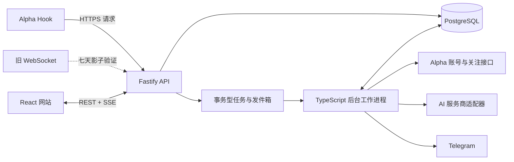

# 私人打新投研工作台技术设计

## 背景

现有 `alpha_apidance_pro` 是一个长期运行的单进程 TypeScript 服务：

- 使用白名单钱包登录 Alpha。
- 通过 Alpha WebSocket 接收共同关注事件。
- 调用 Grok 过滤 KOL、个人、个人开发者和媒体。
- 将通过初筛的项目推送到 Telegram。
- 在 Telegram 讨论群生成一次性 Grok 分析。
- 使用 JSON/JSONL 保存项目状态、任务队列、失败队列和分析归档。

升级后的目标不是给现有服务“加一个页面”，而是把网站和 PostgreSQL升级为完整投研工作台，同时让 Telegram 退回高优先级通知渠道。Alpha 自定义 Hook 成为主要入站通道；达到三星的项目自动进入 Alpha 专用监控分组，复用 Alpha 的新推文和 CA 推送能力。

## 已确认的产品边界

### 使用范围

- 单用户、私人使用，不做公开注册、收费和多租户。
- 部署在一台 VPS 上。
- 网站使用访问密钥登录，后端验证后签发安全会话。
- 使用 HTTPS；钱包私钥、AI Key 和 Hook Secret 不进入浏览器。

### 项目与筛选

- 一个 X 数字用户 ID 唯一对应一个打新项目。
- X handle、昵称和头像是可变资料；改名不产生新项目。
- AI 初筛只负责过滤 KOL、个人、个人开发者和媒体。
- 初筛通过后项目自动进入网站，并自动启动完整报告。
- 初筛持续失败时进入“待确认”，不进入正常项目流、不启动报告。
- 初筛拦截结果在审计页保留 30 天，可人工恢复。
- 人工“删除”实际是可恢复排除；排除后停止 Alpha 持续监控。

### 报告

报告包含：

1. 项目核心信息。
2. 关注理由，内部涵盖当前进展、优点和缺点。
3. 标签。
4. 核心论点。
5. 参与玩法。
6. 风险与证据链，只陈述当前可追溯来源能够支持的风险。

报告不包含独立的背书账号调研，不查询知名关注者关系；官方披露的团队、融资、投资机构和合作伙伴仍可作为项目核心事实。

AI 结果在后端使用结构化格式校验和保存，前端只渲染为可阅读的文档。重大变化生成新报告版本，旧版本不可覆盖。用户的个人笔记与 AI 原文分开保存。

### 战壕、星级与飙升

- 沿用可配置的 1-5 星共同关注阈值。
- 星级只升不降，表示历史最高重要程度。
- 达到三星后自动进入战壕，无需人工批准。
- 战壕项目自动加入 Alpha 专用分组，并开启新推文和 CA 推送。
- 连续 30 天无重要变化，且没有未完成玩法或未来日历事件时转为休眠并停止监控。
- 休眠项目再次收到重要信号时可以恢复战壕状态。
- 60 分钟内共同关注数增加至少 5 个时标记“飙升”，标记持续 6 小时。
- 飙升与星级相互独立；同一飙升窗口只发送一次 Telegram 提醒。

### 新推文与 CA

- Alpha 推送的所有新推文都保存并显示在项目动态中。
- 只有重要变化才触发报告新版本。
- CA 信号只做高亮、地址提取、一键复制和 Telegram 重点提醒。
- 统一使用“检测到 CA”，不验证真假，不称为“官方 CA”，不产生交易建议。

### 台账与日历

- 第一版台账记录项目状态、参与玩法、人工投入、备注和结果。
- 第一版不连接钱包、不读取链上交易、不计算盈亏。
- 日历事件具有来源、置信度和“已确认/待确认”状态。
- 已确认事件默认提前 24 小时和 1 小时发送 Telegram 提醒。
- 待确认事件只显示在网站，不发送 Telegram。

## 目标

1. Alpha 信号可被可靠接收、持久化、去重和重放处理。
2. 网站在初筛通过后立即显示项目，不等待完整报告完成。
3. AI 初筛、证据收集、报告生成和通知互不阻塞。
4. 更换 AI 中转 URL、Key 和模型不需要重启服务。
5. Alpha 接口变化只影响一个适配器，不扩散到项目工作流。
6. 每项重要事实都能追溯到原始证据；无证据时明确标记未确认。
7. 现有历史项目和分析可以迁入 PostgreSQL。
8. 新系统可以与现有 WebSocket/Telegram 链路影子运行 7 天后再切换。

## 非目标

- 公开 SaaS、团队协作、计费和多租户。
- 自建 X 抓取器或第一版接入官方 X API。
- 不保留任何 6551 集成；现有背书关注者、删帖历史、Rug Provider 和 6551 客户端都从新架构中删除。
- 验证 CA 真伪、自动交易或钱包授权。
- 原生 App、PWA 安装和浏览器推送。
- 第一版异地备份。
- Kubernetes、微服务集群、Redis、Kafka或 ClickHouse。
- 精确复制 AlphaRadar 的品牌和视觉设计。

## 总体架构



部署位置分为 Web、API 和 Worker，但业务逻辑不按进程复制。API 只负责身份、入站、查询和 SSE；Worker 通过 PostgreSQL 任务表执行异步工作；共享包拥有项目工作流规则。

## 单仓库结构

```text
apps/
  web/                 React + Vite 网站
  api/                 Fastify HTTP、登录、Hook、REST、SSE
  worker/              PostgreSQL 任务消费者与定时任务
packages/
  domain/              项目工作流、状态机、星级、飙升、报告结构
  db/                  PostgreSQL schema、迁移和查询实现
  alpha/               Alpha 登录、Hook 解析、关注管理适配器
  ai/                  初筛、证据收集、报告与服务商适配器
  notifications/       Telegram 策略与适配器
  config/              环境配置与加密密钥加载
scripts/
  migrate-legacy/      JSON/JSONL 历史数据迁移
  backup/              本地 PostgreSQL 备份与轮换
```

现有 `src/` 和 `tests/` 在迁移完成前继续可运行。每个阶段把经过验证的逻辑迁到新包，避免一次性重写。

## 深模块与接口

### Alpha 接入模块

Alpha 是不可控的外部依赖，因此在 Alpha 接缝定义小接口，由生产 HTTP 适配器和测试适配器共同满足。

```ts
interface AlphaMonitoring {
  ensureMonitored(project: MonitorProject): Promise<MonitorState>;
  stopMonitoring(projectId: ProjectId): Promise<void>;
  reconcile(desired: readonly MonitorProject[]): Promise<ReconcileResult>;
}
```

模块内部隐藏：

- 钱包签名登录和 Token 刷新。
- 专用分组查找/创建。
- `POST /v1/user/follow` 添加账号。
- 新推文与 CA 开关更新。
- 删除或停用账号。
- 429、5xx、Token 失效重试。
- Alpha 内部字段和错误格式。

调用方只表达“项目应当被监控”或“应停止监控”，不能直接拼 Alpha 请求。

Hook 接收由同一包提供纯解析接口：

```ts
interface AlphaEventDecoder {
  decode(input: UnknownWebhook): DecodeResult;
}
```

未知事件不丢弃；原始载荷先入库，再记录 decode 状态。

### 项目工作流模块

项目工作流是系统最深的模块，负责把标准化信号转化为持久化命令：

```ts
interface ProjectWorkflow {
  acceptSignal(signalId: SignalId): Promise<WorkflowResult>;
  applyScreening(result: ScreeningResult): Promise<WorkflowResult>;
  exclude(projectId: ProjectId, reason: string): Promise<WorkflowResult>;
  restore(projectId: ProjectId): Promise<WorkflowResult>;
  applyMateriality(result: MaterialityResult): Promise<WorkflowResult>;
}
```

模块内部隐藏：

- X 数字用户 ID 身份解析。
- 项目创建和重复信号处理。
- 星级只升不降。
- 三星战壕进入。
- 飙升窗口计算与通知抑制。
- 排除、恢复、休眠和再激活。
- 应创建哪些任务与 Outbox 事件。

项目状态变化与任务/通知 Outbox 必须在同一数据库事务中提交。

### AI 调研模块

AI 调研对外提供两种能力，而不是暴露供应商协议：

```ts
interface AccountScreening {
  classify(input: ScreeningInput): Promise<ScreeningResult>;
}

interface ProjectResearch {
  research(input: ResearchInput): Promise<ValidatedReport>;
  classifyUpdate(input: UpdateInput): Promise<MaterialityResult>;
}
```

AI 服务商配置包含：

- 名称、Base URL、加密 API Key。
- 初筛模型和调研模型，可相同。
- 协议类型：OpenAI Chat Completions 或 xAI Responses。
- 能力：普通对话、Web Search、X Search、引用、结构化输出。
- 超时、重试、并发和优先级。
- 主/备用角色与健康状态。

普通 Chat 模型可以执行初筛。完整调研必须路由到具备搜索与引用能力的健康适配器；没有可用调研适配器时报告保持等待状态，禁止生成无证据的“完整报告”。

模型返回的结构化结果通过 Zod 校验。前端不读取原始模型 JSON，只读取报告文档视图。

### 通知策略模块

```ts
interface NotificationPolicy {
  plan(event: DomainEvent): readonly NotificationIntent[];
}
```

策略只允许以下事件进入 Telegram：

- 达到三星并进入战壕。
- 飙升开始。
- 检测到 CA。
- 重要变化。
- 已确认日历提醒。
- Hook 静默、AI任务持续失败、Alpha 同步失败等系统告警。

普通共同关注和日常推文只进入网站。

## PostgreSQL 数据模型

### 原始事件与标准化信号

`raw_events`

- `id uuid`
- `source alpha_hook | alpha_ws | legacy_import`
- `received_at timestamptz`
- `dedupe_key text unique`
- `payload jsonb`
- `decode_status pending | decoded | unsupported | invalid`
- `decode_error text null`

`signals`

- `id uuid`
- `raw_event_id uuid`
- `project_id uuid null`
- `x_user_id text null`
- `type common_follow | new_tweet | ca | profile_change | unknown`
- `occurred_at timestamptz`
- `common_follow_count integer null`
- `x_post_id text null`
- `x_post_url text null`
- `content text null`
- `data jsonb`
- 唯一索引覆盖来源事件和可用的上游事件 ID。

Hook 与 WebSocket 影子期可能收到同一事件，`dedupe_key` 必须基于规范化业务字段生成，而不是只包含传输通道。

### 项目与筛选

`projects`

- `id uuid`
- `x_user_id text unique not null`
- `current_handle text`
- `display_name text`
- `avatar_url text`
- `status screening | active | trench | dormant | pending_review | excluded`
- `highest_star smallint`
- `highest_common_follow_count integer`
- `surge_until timestamptz null`
- `last_material_update_at timestamptz null`
- `excluded_at timestamptz null`
- `exclusion_reason text null`
- `created_at/updated_at`

`project_aliases`

- 保存历史 handle、昵称和观察时间，不改变项目身份。

`screening_decisions`

- `project_id`
- `decision allowed | blocked | failed | manual_allowed | manual_blocked`
- `account_type PROJECT | ALPHA | UNKNOWN | KOL | PERSONAL | DEV | MEDIA`
- `reason`
- `provider_run_id`
- `created_at`
- `audit_expires_at`

### 战壕与监控

`trench_memberships`

- `project_id`
- `entered_at`
- `state active | dormant | stopped`
- `dormant_at null`
- `last_checked_at`

`alpha_monitors`

- `project_id unique`
- `alpha_user_id`
- `alpha_group_id`
- `tweet_enabled`
- `ca_enabled`
- `desired_state enabled | disabled`
- `actual_state pending | enabled | disabled | error`
- `last_synced_at`
- `last_error`

`surges`

- `project_id`
- `window_started_at`
- `baseline_count`
- `peak_count`
- `triggered_at`
- `expires_at`
- `notified_at null`

### 调研、证据与个人记录

`evidence`

- `id uuid`
- `project_id`
- `signal_id null`
- `source_type alpha | x | official_web | docs | github | chain | other`
- `url`
- `title`
- `excerpt`
- `captured_at`
- `content_hash`
- `metadata jsonb`

`report_versions`

- `id uuid`
- `project_id`
- `version integer`
- `trigger_signal_id null`
- `status queued | collecting | generating | ready | failed`
- `structured_document jsonb`
- `rendered_markdown text`
- `change_summary jsonb null`
- `provider_run_id`
- `created_at/completed_at`
- 唯一约束 `(project_id, version)`。

`structured_document` 包含固定章节和证据 ID；`rendered_markdown` 是可导出快照。Web 端通过安全的文档渲染器生成 HTML，不渲染模型提供的任意 HTML。

`personal_notes`

- `project_id`
- `content`
- `created_at/updated_at`

`ledger_entries`

- `project_id`
- `type task | participation | cost | result | note`
- `status planned | active | done | skipped`
- `amount_text null`
- `content`
- `occurred_at null`

`calendar_events`

- `project_id`
- `title`
- `starts_at`
- `status confirmed | pending`
- `source_evidence_id null`
- `confidence numeric null`
- `remind_24h boolean`
- `remind_1h boolean`

### 任务、Outbox 与服务商

`jobs`

- `id uuid`
- `type screen_account | research_project | classify_update | sync_alpha_monitor | send_notification | import_legacy | reconcile`
- `priority integer`
- `status queued | running | retry | succeeded | dead`
- `idempotency_key text unique`
- `payload jsonb`
- `attempts/max_attempts`
- `run_after`
- `locked_at/locked_by`
- `last_error`

Worker 使用 `FOR UPDATE SKIP LOCKED` 领取任务。初始全局 AI 并发为 2，并允许在设置中调整。优先级依次是初筛、CA、首次报告、重要变化、历史更新。

`outbox_events`

- 与业务状态在同一事务中写入。
- Worker 成功投递后标记完成。
- 每种消费者使用独立 idempotency key。

`ai_provider_profiles`

- 保存非秘密配置、能力和路由角色。
- API Key 使用服务端主密钥做 AES-GCM 加密。
- 主密钥只从 VPS Secret 读取，不进入数据库。
- 前端保存后永不回显完整 Key。

`ai_provider_runs`

- 记录任务、服务商、模型、能力、耗时、Token、状态和错误。
- 不记录钱包私钥、完整 API Key 或不必要的完整提示词。

### 会话

`access_sessions`

- 访问密钥本身只保存 Argon2 哈希。
- 登录成功后签发随机会话 Token；数据库只保存其哈希。
- Cookie 使用 `HttpOnly`、`Secure`、`SameSite=Strict`。
- 登录尝试按 IP 限速并记录时间与结果。

## 核心数据流

### 1. Hook 入站

```text
Alpha POST
-> 校验路径 Secret、Content-Type、大小与基础 JSON
-> 计算 dedupe_key
-> 在一个事务中写 raw_events 和 decode job
-> 返回 2xx
-> Worker 异步解码和标准化
```

Hook 请求不等待初筛、报告、Telegram 或 Alpha 关注同步。目标是在本地数据库健康时保持低延迟；任何耗时网络调用都必须在 Worker 中执行。

### 2. 共同关注与初筛

```text
标准化 common_follow signal
-> 解析 X 数字用户 ID
-> 创建或更新项目
-> 更新历史最高共同关注数与星级
-> 首次项目创建 screening job
-> 初筛通过：项目进入 active，创建 research job，发布 SSE 事件
-> 初筛失败：进入 pending_review 并重试
-> 初筛拦截：进入 screening audit
```

只有初筛通过项目出现在普通实时流。初筛通过后卡片立即可见，报告按“证据收集中/生成中/完成”阶段更新。

### 3. 飙升

每个有效共同关注信号写入后，以项目最近 60 分钟的已去重计数为窗口：

- 若最大有效计数相对窗口基线增加至少 5，创建 Surge。
- `surge_until = triggered_at + 6 hours`。
- 同一有效 Surge 不重复创建或重复通知。
- 项目在实时流置顶；过期后自动恢复普通排序。

首次观察到一个高计数不等于飙升；必须有窗口内的可比较基线。

### 4. 三星战壕

```text
初筛已通过 + highest_star >= 3
-> 项目进入 trench
-> 创建 sync_alpha_monitor job
-> AlphaMonitoring.ensureMonitored
-> 加入系统专用分组
-> 开启新推文和 CA，关闭非必要推送
-> 记录 actual_state
```

人工排除、休眠或显式停止时调用 `stopMonitoring`。定时 reconcile 以 PostgreSQL期望状态为准修复 Alpha 分组漂移，但不得操作不属于系统专用分组的人工关注项。

### 5. 新推文、CA 与重要变化

```text
Alpha tweet/CA Hook
-> 原始事件入库
-> 关联 X 数字用户 ID 和项目
-> 动态流立即可见
-> CA：高亮 + Telegram，不验证
-> 普通推文：创建 classify_update job
-> 重要变化：创建新报告版本
-> 非重要变化：只保留动态
```

重要变化分类关注测试网、积分、融资、合作、快照、TGE、玩法规则、截止时间和风险变化。日常宣传和普通转推不得重跑完整报告。

### 6. 报告

```text
research job
-> 选择具备 research 能力的健康服务商
-> 收集 Alpha、X、官网/文档等证据
-> Evidence 入库
-> 模型生成结构化文档并引用 evidence IDs
-> Zod 校验
-> 生成安全 Markdown 快照
-> 报告版本标记为 ready（已完成）
-> 发布 SSE 报告完成事件
```

模型不得直接发明 Evidence URL。证据收集阶段不存在可靠来源时，对应事实必须标记“暂未确认”。

### 7. Telegram

通知意图先写入 Outbox，再由 Worker 发送。消息包含简短摘要和网站详情链接，不保存完整报告，也不再依赖 Telegram 讨论群映射完成工作流。

## HTTP 与 SSE 接口

### 入站和认证

- `POST /webhooks/alpha/:secret`：Alpha Hook，仅允许入库。
- `POST /auth/access-key`：验证访问密钥并创建会话。
- `POST /auth/logout`：撤销当前会话。

### 项目与报告

- `GET /api/projects`：分页、筛选、排序。
- `GET /api/projects/:id`：项目、星级、状态、最新报告摘要。
- `GET /api/projects/:id/signals`：项目动态。
- `GET /api/projects/:id/reports`：报告版本列表。
- `GET /api/projects/:id/reports/:version`：可阅读报告文档数据。
- `POST /api/projects/:id/exclude`：可恢复排除。
- `POST /api/projects/:id/restore`：恢复。
- `POST /api/projects/:id/notes`：个人笔记。

### 审计、战壕与执行

- `GET /api/screening-audit`
- `POST /api/screening-audit/:id/allow`
- `GET /api/trench`
- `GET/POST/PATCH /api/ledger`
- `GET/POST/PATCH /api/calendar`

### 设置与状态

- `GET/POST/PATCH /api/settings/ai-providers`
- `POST /api/settings/ai-providers/:id/test`
- `GET /api/system/status`
- `POST /api/jobs/:id/retry`

### SSE

- `GET /api/events/stream`
- 客户端传递最近事件 cursor；断线重连后补发未读 Outbox 投影事件。
- SSE 只发送资源 ID、事件类型和版本号，客户端再通过 REST 获取完整资源。
- 单向更新场景不引入 WebSocket。

## 网站信息架构

### 第一阶段

1. 访问密钥登录。
2. 实时信号流，默认首页。
3. 项目详情和动态。
4. 可阅读的报告文档与版本状态。
5. 初筛审计和待确认。
6. AI 服务商设置。
7. 基础系统状态。

实时流提供：全部、三星以上、飙升、CA、待确认、已排除筛选。项目卡显示账号、星级、共同关注数、飙升、CA、初筛状态、报告状态、标签和快捷操作。

### 第二阶段

1. 战壕看板。
2. 重要变化和报告版本对比。
3. 台账。
4. 日历和提醒。
5. 更完整的系统状态、失败任务和重试界面。
6. UI 体验专项优化。

前端响应式适配桌面与手机，但不实现 PWA 和浏览器通知。

## 安全设计

- 白名单钱包必须是无资产、仅用于 Alpha 登录的专用钱包。
- 钱包私钥、访问密钥主值、会话签名密钥、AI 加密主密钥和 Hook Secret 使用 VPS Secret/受限环境文件。
- 敏感配置不写普通日志、不返回前端、不进入错误详情。
- AI Key 加密保存；设置页只显示末尾提示。
- Hook 入口与应用入口逻辑隔离。若共用同一 HTTPS Origin，路由层必须确保只有 Hook 路径免会话，并以高熵路径 Secret、请求大小限制和限速保护。
- PostgreSQL 不开放公网端口。
- Web 文档渲染禁止任意 HTML，链接采用安全协议白名单。
- 所有写接口校验会话和 CSRF/Origin。

## 可靠性与可观测性

- 原始事件先入库，再异步处理。
- 所有任务有 idempotency key、超时、重试、死信和人工重试。
- 主/备用 AI 服务商分别做普通对话和调研能力健康检查。
- 系统状态页展示最近 Hook、Alpha 登录、监控同步、队列积压、AI 健康、Telegram、SSE 和最近错误。
- Hook 长时间静默、队列持续积压和 Alpha reconcile 失败发送 Telegram 系统告警。
- VPS 本机每日 `pg_dump`，保留最近 7 天；第一版不做异地备份。
- 备份任务失败必须出现在系统状态页并发送告警。

## 历史迁移

迁移来源：

- `PROJECT_STATE_PATH` 对应的项目状态 JSON。
- `ANALYSIS_ARCHIVE_PATH` 对应的分析归档 JSONL。
- 分析任务、失败消息和死信文件仅作审计导入。

迁移规则：

- 脚本可重复执行，使用来源文件、行号和内容哈希做幂等键。
- 尽量将 handle 解析为 X 数字用户 ID；无法解析的记录进入 migration review，不伪造项目身份。
- 旧分析文本以“历史报告”原样展示。
- 不批量重新生成全部报告。
- 活跃三星项目进入受控重建队列；其他项目在下一次命中时生成新结构化版本。
- 不重新发送历史 Telegram 消息。

## 影子运行与切换

上线后至少 7 天同时运行 Alpha Hook 与现有 WebSocket：

1. 比较按小时和事件类型的接收数量。
2. 统计跨通道重复和仅单通道出现的事件。
3. 验证 Hook 是否包含共同关注、新推文和 CA 的完整载荷。
4. 验证 Alpha 自动关注、开关和删除接口。
5. 验证初筛失败、AI 主备切换、任务重试和 SSE 重连。
6. 比较网站与旧 Telegram 的端到端延迟。

通过标准：

- Hook 载荷足以稳定识别项目和事件类型。
- 未发现无法解释的持续漏发。
- 重复事件不会创建重复项目、报告或通知。
- Alpha 专用分组能由 reconcile 稳定恢复到数据库期望状态。
- 关闭旧 WebSocket 后，系统状态页能及时发现 Hook 静默。

验证通过后关闭旧 WebSocket 主链路和 Telegram 全量消息，只保留关键通知。若 Hook 契约不满足，通过功能开关恢复 WebSocket 入站，不回滚 PostgreSQL和网站架构。

## 测试策略

### 模块接口测试

- 项目工作流通过 PostgreSQL 测试实现验证状态和 Outbox 结果，不测试内部函数调用。
- Alpha 模块使用记录请求的内存适配器，覆盖登录过期、重复添加、开关漂移和删除。
- AI 模块使用固定响应适配器，覆盖初筛、结构化校验、引用缺失、主备切换和能力路由。
- 通知策略以领域事件输入、通知意图输出进行纯测试。

### 集成测试

- 使用 PGLite 或临时 PostgreSQL 跑迁移与事务测试。
- Fastify `inject` 测试访问密钥、Hook、项目查询和写接口。
- SSE 测试 cursor、断线重连和资源版本。
- Worker 测试 `SKIP LOCKED`、重试、死信与幂等。

### 契约测试

- 保存脱敏 Alpha Hook 样本作为 fixture。
- 对 Alpha 关注管理接口只在受控测试账号和专用分组中运行 live smoke test。
- 每个 AI Provider Profile 的“测试连接”分别检查普通对话、搜索、引用和结构化输出。

### 端到端验收

```text
Hook -> raw event -> signal -> screening -> project card -> report document
3 stars -> Alpha monitor -> tweet/CA Hook -> activity -> notification/version
exclude -> monitor removed -> restore -> monitor restored
```

## 验收标准

- Alpha Hook 能在不等待 AI 的情况下可靠入库并快速返回。
- 同一事件经 Hook 与 WebSocket 到达只处理一次。
- 初筛通过项目立即出现在实时流，报告状态按阶段更新。
- 初筛拦截和失败都可在对应审计页面处理。
- 报告前端为可阅读文档，不展示 JSON；关键事实有可点击来源。
- 报告更新不覆盖旧版本，个人笔记不被 AI 修改。
- 三星项目自动进入 Alpha 专用分组并接收新推文/CA。
- 60 分钟增加 5 个共同关注时产生一次 6 小时飙升。
- 排除或休眠项目停止 Alpha 持续监控。
- Telegram 只发送约定的关键通知。
- AI 主服务失败后可切备用；没有调研能力时保持等待，不生成无证据报告。
- 访问密钥、钱包私钥和 AI Key 不泄露到前端或日志。
- 历史 JSON/JSONL 可幂等迁移，旧报告无需批量重跑。
- `npm test`、类型检查、数据库迁移检查和关键端到端测试通过。
